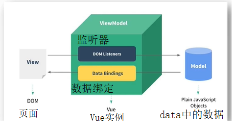
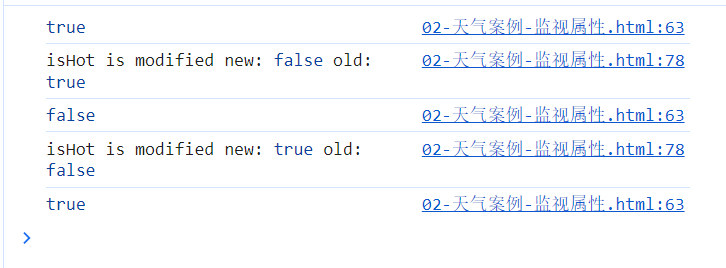
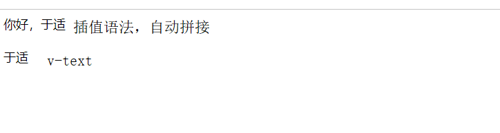
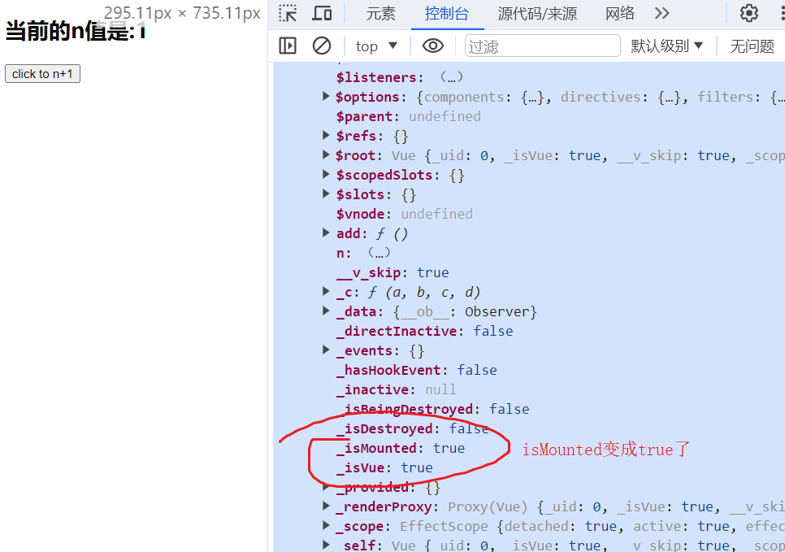

## VUE
* **VUE**
    * 什么是VUE？
        * 是一套用于构建用户界面的渐进式JavaScript框架，简单来说就是程序员把数据通过一系列操作(VUE)，变成用户看见的界面。前端开发工程师的职责：在合适的时候，发出合适的请求，把数据展示到合适的位置。
            * 渐进式：VUE可以自底向上逐层地应用，简单应用，只需引入一个100kb的轻量小巧的核心库；复杂应用的话可以引入各式各样的VUE插件。也就是逐渐从轻量小巧的核心库递进到使用各式各样的Vue插件库。
    * 谁开发的？
        * 尤雨溪 2013 Vue V0.60-2022 VUE V3.x
    * VUE的特点
        * 1. 采用组件化模式，提高代码复用率，且让代码更好维护。一个vue一个组件，可以把自己喜欢的vue文件引入过来，并直接使用，若想要修改某个部分的布局，就直接修改该vue文件的HTML结构即可，不会影响相邻的模块。
            * 
        * 2. 声明式编码，让编码人员无需直接操作DOM，提高开发效率。JS的命令式编码->VUE的声明式编码
        * 3. 使用虚拟DOM + 优秀的Diffing算法，尽量复用DOM节点。将原始的虚拟DOM与新的虚拟DOM进行比较(这个比较就叫Diff)，用Diffing算法进行比较后，一样的直接复用，不一样的增删改。
        * 4. 学习VUE之前要掌握的JS基础知识
            * ES6语法规范：解构赋值，模板字符串，箭头函数等
            * ES6模块化：默认/分别/统一暴露，import，export等
            * 包管理器：npm，yarn，cnpm等
            * 原型、原型链
            * 数组常用方法：过滤/加工数组，筛选最值等
            * axios：async await
            * promise...
    
* **第一章 Vue核心**
    * 1.1 Vue简介
        * 1.1.1 官网
            * 1. 英文官网: https://vuejs.org/
            * 2. 中文官网: https://cn.vuejs.org/
        * 1.1.2 介绍与描述
            * 1. 动态构建用户界面的渐进式 JavaScript 框架
            * 2. 作者：尤玉溪
        * 1.1.3 Vue的特点：
            * 1. 遵循MVVM模式
            * 2. 编码简介，体积小，运行效率高，适合移动端/PC端
            * 3. 它本身只关注 UI, 也可以引入其它第三方库开发项目
        * 1.1.4 与其他JS框架的关联
            * 1. 借鉴Angular的模板和数据绑定技术
            * 2. 借鉴React的组件化和虚拟DOM技术
        * 1.1.5 Vue周边库
            * 1. vue-cli：vue脚手架
            * 2. vue-resource
            * 3. axios
            * 4. vue-router：路由
            * 5. vuex：状态管理
            * 6. elemnt-ui：给予vue的UI组件库(PC端)
    * 1.2 初识Vue
        * ```
            <!-- 准备一个容器 -->
            <div id="root">
                <h1>hello，尚硅谷！</h1>
            </div>
          ```
        * 
        * 创建Vue实例，Vue实例化传且只传一个参数，并且类型是一个对象，管这种对象叫配置对象。像axios，传递的参数也是配置对象，配置对象的key值和value值都有要求，要用指定的，不能乱写，Vue的配置对象也一样。配置对象内的数据，只供与实例绑定的容器使用，以外的管不着。
            * 1. 想让Vue工作，就必须创建一个Vue实例，且要传入一个配置对象
            * 2. root容器里的代码依然符合html规范，只不过混入了一些特殊的Vue语法
                * ```<div id="root"><h1>Hello,{{name}}</h1></div>```中，{{name}}就是特殊语法
            * 3. root容器的代码被称为【Vue模板】
            * ```
                <!-- 创建Vue实例 -->
                const v=new Vue({
                    // 与容器建立关系，el用于制订单那个钱Vue实例为哪个容器服务，值通常为css选择器字符串, 
                    // el:'#root'，也可以写成el:document.getElementById('root')
                    el:'#root',
                    data:{ //data中用于存储数据，数据供el指定的容器使用，值先写成一个对象
                        name:'尚硅谷',
                    }
                })
              ```
            * 4. 一个Vue实例不能同时接管两个容器，Vue实例和容器是一一对应的关系。
                * ```
                    <!-- 准备一个容器 -->
                    <div id="root">
                        <h1>Hello,{{name}},{{address}}</h1>
                    </div>
                    <div id="root2">
                        <h1>Hello,{{name}},{{address}}</h1>
                    </div>
                    <script type="text/javascript">
                        Vue.config.productionTip=false  //组织vue在启动时生成生产提示。

                        // 创建Vue实例
                        new Vue({
                            // 与容器建立关系,el用于制订单那个钱Vue实例为哪个容器服务,值通常为css选择器字符串, 
                            // el:'#root',也可以写成el:document.getElementById('root')
                            el:'#root',
                            data:{ //data中用于存储数据，数据供el指定的容器使用，值先写成一个对象
                                name:'尚硅谷',
                                address:'深圳'
                            }
                        })
                        new Vue({
                            el:'#root2',
                            data:{
                                name:'atguigu',
                                address:'北京昌平'
                            }
                        })
                  ```
                * 
            * 5. 真实开发中只有一个Vue实例，并且会配合着组件一起使用。
            * 6. 写在容器里的{{xxx}}里的代码必须写JS表达式，且xxx可以自动读取到data中的所有属性。
            * 7. 一旦data中的数据发生改变，页面中用到该数据的地方也会自动更新
                    * 
    * 1.3 模板语法
        * 1.3.1 效果
            * 
        * 1.3.2 模板的理解，html中包含一些JS语法代码，语法分为两种，分别为：
            * 1. 插值语法(双大括号表达式)
            * 2. 指令语法(以 v- 开头)，用于管理标签属性
        * 1.3.3 插值语法
            * 1. 功能：用于解析/指定标签体内容
            * 2. 语法：{{xxx}}，xxx会作为js表达式解析，且可以直接读取到data中的所有属性
        * 1.3.4 指令语法
            * 1. 功能：用于解析/管理标签(包括标签属性、标签体内容、绑定事件...)
            * 2. 举例：v-bind:href="xxx" 或 简写为 :href="xxx"，xxx同样要写js表达式，且可以直接读取到data中的所有属性。
            * 3. 备注：Vue中有很多指令，且形式都是：v-???，在这里先学v-bind
    * 1.4 数据绑定
        * 1.4.1 效果
        * 1.4.2 单向数据绑定
            * 1. 语法：v-bind:href="xxx" 或简写为 :href
            * 2. 特点：数据只能从data流向页面
                * 
        * 1.4.3 双向数据绑定
            * 1. 语法：v-model:value="xxx" 或简写为 v-model="xxx"
            * 2. 特点：数据不仅能从data流向页面，还能从页面流向data
                * 
            * 3. 备注：
                * 双向绑定一般都应用在都应用在表单类元素上(如，input、select等)。
                * v-model:value 可以简写为 v-medel，因为v-medel默认收集的就是value值。
                * 如下类代码是错误的，因为v-model只能应用在表单类/输入类元素上，因为标题类标签无法捕获用户的输入，有value标签属性的就叫输入类元素。
                * ```<h2 v-model:x="name">hi</h2>```
    * 1.5 el和data的两种写法
        * 1.5.1 el的两种写法
            * 1. new Vue的时候配置el属性
            * 2. 先创建Vue实例，随后再通过vm.$mount('#root)指定el的值。
        * 1.5.2 data的两种写法
            * 1. 对象式
            * 2. 函数式
            * 选哪个？ 目前是哪个都行，以后学到组件的时候，必须写函数式，要不然出事儿
        * **1.5.3 一个重要原则**
            * 由Vue管理的函数，一定不能写箭头函数，必须是普通函数，一旦写了箭头函数，this指向的就不是Vue实例了，而是Window，且data函数也可以简写成```data(){....}```
                * ```
                    data:function(){
                        console.log('data',this);  //此处的this是Vue实例对象
                        return{
                            name:'谷江山'
                        }
                    }
                  ```
    * 1.6 MVVM模型
        * 1. M：模型(Model)：对应data中的数据
        * 2. V:视图(View)：模板
        * 3. VM：视图模型(ViewModel)：Vue实例对象
            * 
            * 
        * 观察发现：
            * 1. data中所有的属性，最后都出现在了vm身上
            * 2. vm身上是所有的属性 及 Vue原型上所有属性，在Vue模板中都可以直接使用
    * 1.7 数据代理
        * 1.7.1 Vue中的数据代理：
            * 通过vm对象来代理data对象中熟悉宁德操作(读/写)
        * 1.7.2 Vue中数据代理的好处：
            * 更加方便地操作data中的数据
        * 1.7.3 基本原理
            * 通过Object.defineProperty方法把data对象中所有的属性添加到vm上。
            * 为每一个添加到vm上的属性，都制定一个getter/setter。
            * 在getter/setter内部去操作(读/写)，data中对应的属性。
            * 
    * 1.8 事件处理
        * 1.8.1 效果
        * 1.8.2 绑定监听/事件的基本使用
            * 1. 使用v-on:xxx 或 @xxx 绑定事件，其中xxx是事件名；
            * 2. 事件的回调需要配置在methods对象中，最终会在vm上；
            * 3. methods中配置的函数，不可以使用箭头函数，否则this的指向就不是vm，而是Window；
            * 4. methods中配置的函数，都是被Vue所管理的函数，this的指向是vm或组件实例对象
            * 5. @click="demo" 或 @click="demo($event)" 效果一直，但后者可以传参。
                * ```
                    const vm=new Vue({
                        el:'#root',
                        data:{
                            name:'尚硅谷',
                            address:'北京'
                        },
                        methods:{
                            // 函数不能是箭头函数，只能是普通函数，否则this指向不同(箭头函数this为Window，普通函数才是vm，也就是Vue实例)，会导致后续出现一系列问题
                            showInfo1(event) {
                                // console.log(event.target.innerText);
                                // console.log(this===vm);  //此处的this是vm，也就是Vue实例对象
                                alert('你好')
                            },
                            showInfo2(event,number) {
                                // console.log(event.target.innerText);
                                // console.log(this===vm);  //此处的this是vm，也就是Vue实例对象
                                console.log(event,number);  //PointerEvent,66
                                // alert('hello')
                            }
                        }
                    })
                  ```
        * 1.8.3 事件修饰符
            * 1. prevent：阻止默认事件(常用)，一般点击弹出的提示框后会跳转到指定的网页中，给点击事件加上.prevent就不会跳转。
                * ```<a href="https://github.com/tianyuan65" @click.prevent="showInfo">click to baidu</a>```
            * 2. stop：阻止事件冒泡(常用)，冒泡事件会从子级冒到父级，添加.stop后不光不会从子级冒到父级，也不会从父级继承到子级。
                * ```
                    <div class="demo1" @click="showInfo">
                        <button @click.stop="showInfo">click to show information</button>
                    </div>
                  ```
            * 3. once：事件只触发一次(常用)，原本点击几次按钮就会弹出几次提示框，添加.once后，只会触发一次，第二次开始就不会触发。
                * ```<button @click.once="showInfo">click to show information</button>```
            * 4. capture：使用事件的捕获模式，添加该修饰符前，会先捕获子级，再捕获父级元素，添加.capture后会先捕获父级元素，再捕获子级。
                * ```
                    <div class="box1" @click.capture="showMsg(1)">
                        div1
                        <div class="box2" @click="showMsg(2)">div2</div>
                    </div>
                  ```
            * 5. self：只有event.target是当前操作的元素时才触发事件，点击的元素是什么，就输出什么，点了子级元素，绝不会展示父级元素。
                * ```
                    <div class="demo1" @click.self="showInfo">
                        <button @click="showInfo">click to show information</button>
                    </div>
                  ```
                * 
            * 6. passive：事件的默认行为立即执行，无需等待事件回调执行完毕，给鼠标滚轮事件添加该修饰符，首先执行滚轮事件，而不是触发滚轮事件的函数。
                * ```
                    <ul @wheel.passive="demo" class="list">
                        <li>1</li>
                        <li>2</li>
                        <li>3</li>
                        <li>4</li>
                    </ul>

                    demo(){
                        for (let i = 0; i < 100; i++) {
                            console.log('@@');
                        }
                        console.log('scrolled to die');
                    }
                  ```
            * 补充：
                *  修饰符可以连续写，以下面的代码为例，可以先阻止冒泡，再阻止默认跳转，也可以先阻止默认跳转，再阻止冒泡。虽然写法有出入，但效果是一样的。
                    * ```
                        <!-- 既阻止冒泡，又阻止默认事件 -->
                        <div class="demo1" @click="showInfo">
                            <!-- 先阻止冒泡，再阻止默认跳转，也可以是.prevent.stop，那就是先阻止默认事件，后阻止冒泡 -->
                            <a href="https://github.com/tianyuan65" @click.prevent.stop="showInfo">click to show information</a>
                        </div>
                      ```
        * 1.8.4 按键修饰符
            * 1. Vue中常用的按键别名：意思是，添加了这些按键别名的话，输入内容后，按了添加的按键别名才可以看到输出，如：``` <input type="text" placeholder="按下回车提示输入" @keyup.enter="showInfo">```
                * 回车 => enter
                * 删除 => delete(捕获“删除”和“退格”键)
                * 退出 => esc
                * 空格 => space
                * 换行 => tab，该按键别名只能搭配@keydown使用，因为它本身的特殊性，会把焦点从当前元素上切走，按下tab键，还没抬起来焦点就被切走了，这就导致无法正常触发事件。
                * 上 => up
                * 下 => down
                * 左 => left
                * 右 => right
            * 2. Vue未提供别名的按键，可以使用按键原始的key值去绑定，但注意要转为kebab-case(短横线命名)
            * 3. 系统修饰键(用法特殊)：ctrl、alt、shift、meta
                * 配合keyup使用：按下修饰键的同时，再按下其他键，随后释放其他键，事件才被触发
                    * 
                * 配合keydown使用：正常触发事件，与tab一样只能是配合keydown使用。
            * 4. 也可以使用keyCode去指定具体的按键(不推荐)，```@keydown.13```，以回车键为例，但不被推荐了
            * 5. Vue.config.keyCodes.自定义键名 = 键码，可以去定制按键别名
                * ```
                    <input type="text" placeholder="按下回车提示输入" @keydown.huiche="showInfo">
                    // 自定义按键别名
                    Vue.config.keyCodes.huiche=13
                  ```
            * 补充：
                * 按键修饰符也可以按照指定要求连写，以下方代码为例。
                    * ```
                        <!-- 按键修饰符也可以按照要求连写 -->
                        <input type="text" placeholder="按下回车提示输入" @keydown.ctrl.y="showInfo">
                      ```
                    * 
    * 1.9 计算属性与监视
        * 1.9.1 计算属性-姓名案例的三种实现
            * 1. 插值语法实现
                * ```
                    <!-- 容器 -->
                    <div id="root">
                        姓：<input type="text" v-model="firstName">
                        <br/>
                        <br/>
                        名：<input type="text" v-model="lastName">
                        <br/>
                        <br/>
                        姓名：<span>{{firstName}}-{{lastName}}</span>
                    </div>
                    <script type="text/javascript">
                        Vue.config.productionTip = false //阻止 vue 在启动时生成生产提示。

                        const vm=new Vue({
                            el:'#root',
                            data:{
                                firstName:'张',
                                lastName:'三'
                            }
                        })
                    </script>
                  ```
            * 2. methods实现，在展示姓名的标签span中，用插值将methods中的方法添加进去。若添加的是showName，那打印展示出来的就是showName这个函数；但若天家的事showName()，打印展示的才是调用showName方法后，其中返回的值，其返回值就用this.firstName/lastName来获取Vue实例中保存的姓和名。
                * ```
                    <!-- 容器 -->
                    <div id="root">
                        姓：<input type="text" v-model="firstName">
                        <br/>
                        <br/>
                        名：<input type="text" v-model="lastName">
                        <br/>
                        <br/>
                        <!-- 在插值语法里，把showName方法调用后的返回值插入到这个位置；但是只写showName的话，只是把showName这个函数插入到了这个位置 -->
                        姓名：<span>{{showName()}}</span>
                    </div>
                    <script type="text/javascript">
                        Vue.config.productionTip = false //阻止 vue 在启动时生成生产提示。

                        const vm=new Vue({
                            el:'#root',
                            data:{
                                firstName:'张',
                                lastName:'三'
                            },
                            methods:{
                                // 该方法不作为事件的回调使用，要我本人自己去调用
                                showName(){
                                    // 并返回其值
                                    return this.firstName + '-' + this.lastName
                                }
                            }
                        })
                    </script>
                  ```
            * 3. 计算属性实现
                * 定义：要用的属性不存在，要通过**已有属性**计算得来。
                * 原理：底层实现了Object.defineProperty方法提供的getter和setter。
                * get函数什么时候执行？
                    * (1). 初次读取时，会执行一次；
                    * (2). 当依赖的数据发生改变时，会被在此调用。
                * 优势：与methods实现相比，内部有缓存机制(复用)，效率更高，调试方便。
                * 备注：
                    * 1. 计算属性最终会出现在vm上，直接读取使用即可。
                    * 2. 如果计算属性要被修改，那必须写set函数去响应修改，且set中要引起计算时依赖的数据发生改变。
                * 完整代码如下：
                * ```
                    <!-- 容器 -->
                    <div id="root">
                        姓：<input type="text" v-model="firstName">
                        <br/>
                        <br/>
                        名：<input type="text" v-model="lastName">
                        <br/>
                        <br/>
                        <!-- 在插值语法里，把showName方法调用后的返回值插入到这个位置；但是只写showName的话，只是把showName这个函数插入到了这个位置 -->
                        姓名：<span>{{fullName}}</span>
                    </div>
                    <script type="text/javascript">
                        Vue.config.productionTip = false //阻止 vue 在启动时生成生产提示。

                        const vm=new Vue({
                            el:'#root',
                            // 在data中存着的是属性
                            data:{
                                firstName:'张',
                                lastName:'三'
                            },
                            // 计算属性放在这里，
                            computed:{
                                // 且计算属性里的对象属性也就是fullName不能直接赋值，要把整个计算过程配置成一个对象
                                fullName:{
                                    get(){
                                        console.log('get his name');
                                        // console.log(this);  //此处的this是Vue实例，也就是vm
                                        return this.firstName + '-' + this.lastName
                                    },
                                    set(value){
                                        // console.log('set the data',value);  //set the data 王五
                                        const arr=value.split('-')
                                        this.firstName=arr[0]
                                        this.lastName=arr[1]
                                    }
                                }
                            }
                        })
                    </script>
                  ```
                * 效果图们：
                    * 
                    * 
                    * 
                    * 
                    * 
                    * 
                    * 
            * 补充，计算属性简写版
                * 有个前提条件，一旦确定计算属性只考虑读取(读取Vue实例中的属性)，不考虑修改(不在控制台等地方中修改Vue实例的属性)时，也就是只读不改时，才可以使用简写形式。且此时fullName就当做函数用，这个函数就对应上面代码的get函数，fullName代表计算属性的名字，也代表函数的名。代码如第一个，再进一步简写可得第二个代码段，表面上fullName是一个函数，但实际上，是fullName函数执行完后，向Vue实例放了一个叫fullName的属性，此时Vue实例中fullName属性的值就是fullName函数调用的结果。效果和完整版是一样的，图片就不展示了。
                    * ```
                        fullName:function () {
                            console.log('get his name');
                            // console.log(this);  //此处的this是Vue实例，也就是vm
                            return this.firstName + '-' + this.lastName
                        }
                      ```
                    * ```
                        fullName () {
                            console.log('get his name');
                            // console.log(this);  //此处的this是Vue实例，也就是vm
                            return this.firstName + '-' + this.lastName
                        }
                      ```
        * 1.9.2 监视属性(watch)-天气案例
            * 1. 用计算属性完成，配置computed属性，在computed中设置info函数，info函数中进行this.isHot值的判断，并返回其值，作为info属性的值，放在切换天气的模板中。methods中配置changeWeather函数，并绑定在切换天气状态的按钮上，changeWeather函数内将与this.isHot相反的值赋给它，以便在点击按钮时，切换天气状态。
                * ```
                    <div id="root">
                        <h1>今天天气很{{info}}</h1>
                        <button @click="changeWeather">切换天气</button>
                    </div>
                    <script type="text/javascript">
                        Vue.config.productionTip = false //阻止 vue 在启动时生成生产提示。

                        const vm=new Vue({
                            el:'#root',
                            data:{
                                isHot:true
                            },
                            computed:{
                                info(){
                                    console.log(this.isHot);  //炎热时true，凉爽时false
                                    return this.isHot?'炎热':'凉爽'
                                }
                            },
                            methods:{
                                changeWeather(){
                                    this.isHot=!this.isHot
                                }
                            }
                        })
                    </script>
                  ```
                * 切换效果图
                    * 
                    * 
                    * 
                    * 
            * 2. 监视属性watch
                * (1). 当贝监视的属性变化时，回调函数自动调用你，进行相关操作
                * (2). 监视的属性必须存在，才能进行监视！！
                * (3). 监视属性完成天气案例方法1，Vue实例中配置watch属性。在watch中添加想要监视的属性名，并为其配置对象，在其中设置handler函数，handler函数在监视的属性的值(在这里是isHot)发生改变时，会被调用。所以，总结的话，想要监视哪个属性，watch属性中，就写那个想要监视的属性名，并为其配置对象，比如computed属性中的info也可以被监视，代码和效果图就不写了。
                * 
                * handler函数：handler函数还会接收两个参数，newValue和oldValue，该函数可以获取和输出新值和旧值，效果如下图：
                    * 
                * immediate：初始化时，让handler调用一下，其默认值为false，但将其值改为true时，handler就会先于其他函数执行，如图：
                    * 
                * ```
                    watch:{
                        // 想要监视谁，就写谁的名字，在这里是isHot；怎么监视，需要配置一个对象
                        isHot:{
                            // immediate属性，表示是否立即执行，默认值为false，handler函数不会立即执行，当将其值改为true时，handler函数就会被立即调用
                            immediate:true,
                            // handler函数什么时候调用？当isHot发生改变时
                            handler(newValue,oldValue){
                                console.log('handler function run,isHot is modified','new:',newValue,'old:',oldValue);
                            }
                        }
                    }
                  ```
                * 监视属性完成天气案例方法2。首先保证，Vue实例已创建，创建实例后，用$watch()，来实现监视。$watch()中传递两个参数，第一个参数是要监视的属性/对象名，第二个参数就是为其配置的对象.
                    * ```
                        vm.$watch('isHot',{
                            // immediate属性，表示是否立即执行，默认值为false，handler函数不会立即执行，当将其值改为true时，handler函数就会被立即调用
                            // immediate:true,
                            // handler函数什么候调用？当isHot发生改变时
                            handler(newValue,oldValue){
                                console.log('handler function run,isHot is modified','new:',newValue,'old:',oldValue);
                            }
                        })
                    ```
                * 补充：两种方式选择哪种？若很明确监视的属性/对象，在创建Vue时，已明确要监视的属性/对象，就用第一个，也就是把要监视的属性/对象名写在watch属性里；但若创建实例时，要监视的属性/对象不明确，后续需要根据用户的行为明确了需要监视的属性/对象时，就用第二个方法，也就是在外面使用$watch()，在其中$watch()内传递两个参数，第一个参数为要监视的属性/对象名，第二个参数就是为其配置的对象，对象内内容和第一个方法watch对象的内容一样，效果也一样。
            * 3. 深度监视
                * 3.1 Vue中的watch默认不检测对象内部值的改变(一层)
                    * 监视多级结构中某个属性的变化时，需要监视的属性名，也就是key要求写最原始的写法，像```'numbers.a'```
                        * ```
                            data:{
                                isHot:true,
                                numbers:{
                                    a:1,
                                    b:1
                                }
                            },
                            watch:{
                                // 监视多级结构中某个属性的变化，key最原始的写法，这样就可以检测到a了
                                'numbers.a':{
                                    handler(){
                                        console.log('a is changed');
                                    }
                                }
                            }
                          ```
                        * 
                * 3.2 配置deep:true可以监测对象内部值改变(多层)
                    * 监视多级结构中的多个/所有属性的变化时，给需要监视的属性内配置deep配置项，deep属性默认值为false，开启该配置属性后，监视的属性内的任何一个子属性发生变化，都会调用handler函数。
                        * ```
                            data:{
                                isHot:true,
                                numbers:{
                                    a:1,
                                    b:1
                                }
                            },
                            watch:{
                                numbers:{
                                    // 添加deep配置项，其默认值为false，一旦开启，numbers属性内的任何一个属性的值发生变化都会调用handler函数
                                    deep:true,
                                    handler(){
                                        console.log('numbers changed');
                                    }
                                }
                            }
                          ```
                        * 
                    * (1). Vue自身可以监测对象内部值的改变，但Vue提供的watch默认不可以！！
                    * (2). 使用watch时，根据数据的具体结构，决定是否采用深度监测。
            * 4. 天气案例简写版。**注意：写简写版的前提条件为，不配置immediate和deep属性，监视属性里只有handler函数是才可以使用简写版。**和计算属性类似，函数名表示监视的属性，不考虑修改，只引用data属性中的数据，就直接把isHot写成函数形式，把handler函数的参数和函数内执行的内容搬到isHot中。除了已明确监视的属性，从而在Vue实例中配置watch属性的方法，还有在尚不明确监视的属性的时候，通过$watch()来监视的简写版。完整版中传递的第二个参数为一个对象，简写版中直接将函数作为第二个参数，并为其传递handler函数中传递的两个参数，函数内的情况与完整版一样，当然效果也一样。(注：函数不可以是箭头函数，会导致this指向window，在这里this的指向应是Vue实例。)
                * ```
                    isHot(newValue,oldValue){
                        console.log('handler function run,isHot is modified','new:',newValue,'old:',oldValue);
                    }
                  ```
                * ```
                    // 监视属性方法2-简写版：
                    // 完整版第二个参数应为对象，在此改为函数，并为该函数传递完整版handler函数的参数
                    vm.$watch('isHot',function(newValue,oldValue){
                        console.log('handler function run,isHot is modified','new:',newValue,'old:',oldValue);
                    })
                  ```
            * 5. 姓名案例-watch实现。通过计算属性的学习，可得知，姓和名发生变化，可以在computed属性中通过计算获取变化的值，再进行输出。在watch中同样，需要先配置全名的初始值，并分别监视姓和名，再对其进行输出。代码如下：
                * ```
                    data:{
                        firstName:'张',
                        lastName:'三',
                        // 需要配置初始值
                        fullName:'张-三'
                    },
                    watch:{
                        // 监视姓
                        firstName(value){
                            // 修改姓的时候，全名就是新修改的姓value+原先的名this.lastName
                            this.fullName=value + '-' + this.lastName
                        },
                        // 监视名
                        lastName(value){
                            // 修改名的时候，全名就是原先的名this.firstName+新修改的名value
                            this.fullName=this.firstName + '-' + value
                        }
                    }
                  ```
            * 总结：
                * computed和watch的区别：
                    * 1. computed能完成的功能，watch都可以完成。计算属性靠的是fullName的返回值，但目前无法办到在计算属性的函数中做到延时执行，也就是计算属性中，无法开启异步任务去维护数据。与之相对的，watch属性不靠返回值，在其中就可以在每个监视的属性中开启异步任务，因为监视属性里的值是我一个字一个字敲出来的。所以总结的话，当watch也能实现，computed也能实现的时候，怎么简单怎么来，也就是用computed，但若有异步任务需求的时候就用watch。
                    * 2. watch能完成的功能，computed不一定能完成，例如：watch可以进行异步操作。watch中开启的定时器函数中写了箭头函数，能写成箭头函数的原因是，定时器函数虽然开启在了Vue实例所管理的fullName函数内，但该定时器所指定的回调函数不归Vue实例管理，是浏览器定时管理模块控制，定时器到点也是js引擎帮我调的。
                        * ```
                            firstName(value){
                                setTimeout(()=>{
                                    // 修改姓的时候，全名就是新修改的姓value+原先的名this.lastName
                                    this.fullName=value + '-' + this.lastName
                                },1000)
                            }
                          ```
                * 两个重要的小原则：
                    * 1. 所被Vue管理的函数，最好写成普通函数，这样this的指向才是Vue实例或组件实例对象。
                    * 2. 所有不被Vue所管理的函数(定时器的回调，ajax的回调，Promise的回调等)，最好写成箭头函数，这样this的执行才是Vue实例或组件实例对象。
    * 1.10 class与style绑定
        * 1.10.1 理解
            * 1. 在应用界面中，某个(些)元素的样式是变化的
            * 2. class/style绑定就是专门用来实现动态样式效果的技术
        * 1.10.2 class绑定
            * 写法：:class="xxx"  xxx可以是字符串、对象、数组
                * 1. 字符串写法适用于，类名不确定，要动态获取
                    * ```
                        <div class="basic" :class="mood" @click="changeMood">{{name}}</div>
                        data:{
                            name:'尚硅谷',
                            mood:'normal',
                        },
                        methods:{
                            changeMood(){
                                // 点击div心情变为happy
                                this.mood='happy'
                            }
                        }
                      ```
                * 2. 对象写法适用于，要绑定多个样式，个数不确定，名字也不确定。需要用到某个/些样式时，就把数据中心保存的属性对象中表示样式的的属性值改为true，即可应用。
                    * ```
                        <div class="basic" :class="classObj">{{name}}</div>
                        data:{
                            name:'尚硅谷',
                            mood:'normal',
                            classObj:{
                                atguigu1:false,
                                atguigu2:false,
                                atguigu3:false
                            }
                        }
                      ```
                * 3. 数组写法适用于，要绑定多个样式，个数确定，名字也确定，但不确定用不用
                    * ```
                        <div class="basic" :class="classArr">{{name}}</div>
                        data:{
                            name:'尚硅谷',
                            mood:'normal',
                            classArr:['atguigu1','atguigu2','atguigu3']，
                        },
                        methods:{
                            changeMood(){
                                // 点击div随机转换心情，创建数组arr，将三个字符串塞进去，随后随机生成三个索引值中的一个作为arr的索引，去展示心情
                                const arr=['happy','sad','normal']
                                // 随机生成0,1,2中的一个
                                const index=Math.floor(Math.random()*3)
                                this.mood=arr[index]
                            }
                        }
                      ```
        * 1.10.3 style绑定，style绑定不常用，并且style绑定里的数组写法2，更不常用，因为代码冗长，一般用也是用数组写法1.
            * 1. 对象写法： :style="{fontSize:xxx}" 其中的xxx是动态值
                * ```
                    <div class="basic" :style="styleObj">{{name}}</div>
                    data:{
                        name:'尚硅谷',
                        mood:'normal',
                        styleObj:{
                            fontSize:'40px',
                            color:'aqua'
                        }
                    }
                  ```
            * 2. 数组写法1：
                * ```
                    <div class="basic" :style="[styleObj,styleObj2]">{{name}}</div>
                    data:{
                        name:'尚硅谷',
                        mood:'normal',
                        styleObj:{
                            fontSize:'40px',
                            color:'aqua'
                        },
                        styleObj2:{
                            background:'violet'
                        }
                    }
                  ```
            * 3. 数组写法2：
                * ```
                    <div class="basic" :style="styleArr">{{name}}</div>
                    data:{
                        name:'尚硅谷',
                        mood:'normal',
                        styleArr:[
                            {
                                fontSize:'40px',
                                color:'#bfa'
                            },
                            {
                                background:'gold'
                            }
                        ]
                    }
                  ```
    * 1.11 条件渲染
        * 条件渲染指令
            * 1. v-if：
                * 写法:(1). v-if="表达式"
                * (2). v-else-if="表达式"
                * (3). v-else="表达式"
                * 适用于切换频率较低的场景
                * 特点：不展示DOM元素直接被移除，而不是隐藏
                * 注意：v-if可以和 v-else-if、v-else一起使用，但要求结构不能被打断，意思就是中间不能有其他的标签存在。
                * 当```<h2 v-show="n===1">你好</h2><h2 v-show="n===1">谷江山</h2><h2 v-show="n===1">于适</h2>```出现这种情况时，每个h2标签上添加v-show标签会显得代码冗长，所以可以使用template标签将这些都包起来，并使用v-if，因为template需要和v-if配合使用，无法与v-show配合。template作为模板，页面渲染时会被拖掉，也就是不会展示template标签，代码和效果图如下：
                    * ```
                        <template v-if ="n===1">
                            <h2>你好</h2>
                            <h2>谷江山</h2>
                            <h2>于适</h2>
                        </template>
                      ```
                    * 
            * 2. v-show：
                * 写法：v-show="表达式"
                * 适用于切换频率较高的场景
                * 特点：不展示DOM元素，数据不是被移除，而仅仅是使用样式隐蔽掉
            * 3. 备注：使用v-if时，元素可能无法获取到，而使用v-show一定可以获取到
    * 1.11 列表渲染
        * 1.11.1 列表显示指令
            * v-for指令
                * 1. 用于展示列表数据
                * 2. 语法：v-for="(item,index) in xxx" :key="yyy"
                * 3. 可遍历：数组、对象、字符串(用得很少)、指定次数(用得很少)
                    * 遍历数组：
                        * ```
                            <h2>人员列表(遍历数组)</h2>
                            <ul>
                                <!-- 使用v-for进行遍历，就需要配置key属性来为每一个结构打一个独一无二的标识，以免数据混乱，p代表遍历的每一项，index代表索引值 -->
                                <!-- <li v-for="p in personArr" :key="p.id"> -->
                                <li v-for="(p,index) in personArr" :key="index">
                                    <!-- p这个形参可以直接在标签体内使用 -->
                                    {{p.name}}-{{p.age}}--{{index}}
                                </li>
                            </ul><hr>
                            data:{
                                personArr:[
                                    {id:'001',name:'张三',age:18},
                                    {id:'002',name:'李四',age:19},
                                    {id:'003',name:'王五',age:20}
                                ]
                            }
                          ```
                        * 
                    * 遍历对象：
                        * ```
                            <!-- 遍历对象 -->
                            <h2>包信息(遍历对象)</h2>
                            <ul>
                                <li v-for="(value,key) of bags" :key="key">
                                    {{key}}-{{value}}
                                </li>
                            </ul><hr>
                            data:{
                                bags:{
                                    name:'dior',
                                    price:'19999',
                                    color:'black'
                                }
                            }
                          ```
                        * 
                    * 遍历字符串：
                        * ```
                            <!-- 遍历字符串 -->
                            <h2>测试字符串(用得少)</h2>
                            <ul>
                                <li v-for="(char,index) of str" :key="index">
                                    {{index}}-{{char}}
                                </li>
                            </ul><hr>
                            data:{
                                str:'hello'
                            }
                          ```
                        * 
                    * 遍历指定次数：数字代表遍历几次，参数number代表数值，参数index代表索引值
                        * ```
                            <!-- 遍历指定次数 -->
                            <h2>测试遍历指定次数(用得少)</h2>
                            <ul>
                                <li v-for="(number,index) of 5" :key="index">
                                    {{index}}-{{number}}
                                </li>
                            </ul><hr>
                          ```
                        * 
        * 1.11.2 key的原理
            * 面试题：react、vue中的key有什么作用？(key的内部原理)
                * 1. 虚拟DOM中key的作用：
                    * key是虚拟DOM对象的标识，当数据发生变化时，Vue会根据【新数据】生成【新的虚拟DOM】，随后Vue进行【新虚拟DOM】与【旧虚拟DOM】的差异比较，比较规则如下：
                * 2. 对比规则：
                    * (1). 旧虚拟DOM中找到了与新虚拟DOM相同的key：
                        * a. 若虚拟DOM中内容没变，直接使用之前的真实DOM
                        * b. 若虚拟DOM中内容变了，则生成新的真实DOM，随后替换掉页面中之前的真实DOM。
                    * (2). 旧虚拟DOM中未找到新虚拟DOM相同的key，则创建新的真实DOM，随后渲染到页面。
                * 3. 用index作为key属性的值可能会引发的问题：
                    * a. 若对数据进行逆序添加、逆序删除(就是把新数据添加到最前面或把最前面的数据删除)等破坏顺序的操作，会产生没必要的真实DOM更新
                    * b. 如果结构中还包含输入类的DOM，会产生错误DOM更新==>界面出现问题
                    * ```
                        <div id="root">
                            <!-- 遍历数组 -->
                            <h2>人员列表(遍历数组)</h2>
                            <button @click.once="add">添加一个老6</button>
                            <ul>
                                <li v-for="(p,index) in personArr" :key="index">
                                    {{p.name}}-{{p.age}}
                                    <input type="text" placeholder="输入姓名">
                                </li>
                            </ul><hr>
                        </div>
                        const vm=new Vue({
                            el:'#root',
                            data:{
                                personArr:[
                                    {id:'001',name:'张三',age:18},
                                    {id:'002',name:'李四',age:19},
                                    {id:'003',name:'王五',age:20}
                                ]
                            },
                            methods:{
                                add(){
                                    const p={id:'004',name:'老6',age:21}
                                    this.personArr.unshift(p)
                                }
                            }
                        })
                      ```
                    * 
                * 4. 开发中如何选择key？
                    * a. 最好使用每条数据的唯一标识作为key属性的值，比如：id、手机号、身份证号、学号等；
                        * ```
                            <div id="root">
                            <!-- 遍历数组 -->
                            <h2>人员列表(遍历数组)</h2>
                            <button @click.once="add">添加一个老6</button>
                            <ul>
                                <li v-for="(p,index) in personArr" :key="p.id">
                                    {{p.name}}-{{p.age}}
                                    <input type="text" placeholder="输入姓名">
                                </li>
                            </ul><hr>
                            </div>
                            const vm=new Vue({
                                el:'#root',
                                data:{
                                    personArr:[
                                        {id:'001',name:'张三',age:18},
                                        {id:'002',name:'李四',age:19},
                                        {id:'003',name:'王五',age:20}
                                    ]
                                },
                                methods:{
                                    add(){
                                        const p={id:'004',name:'老6',age:21}
                                        this.personArr.unshift(p)
                                    }
                                }
                            })
                          ```
                        * 
                    * b. 如果不存在对数据的逆序添加、逆序删除等破坏顺序操作，仅用于渲染列表用于展示。使用index作为key的值时没问题的。
                        * ```
                            <div id="root">
                            <!-- 遍历数组 -->
                            <h2>人员列表(遍历数组)</h2>
                            <button @click.once="add">添加一个老6</button>
                            <ul>
                                <li v-for="(p,index) in personArr" :key="index">
                                    {{p.name}}-{{p.age}}
                                    <input type="text" placeholder="输入姓名">
                                </li>
                            </ul><hr>
                            </div>
                            const vm=new Vue({
                                el:'#root',
                                data:{
                                    personArr:[
                                        {id:'001',name:'张三',age:18},
                                        {id:'002',name:'李四',age:19},
                                        {id:'003',name:'王五',age:20}
                                    ]
                                },
                                methods:{
                                    add(){
                                        const p={id:'004',name:'老6',age:21}
                                        this.personArr.push(p)
                                    }
                                }
                            })
                          ```
                        * 
        * 1.11.3 列表过滤
            * 需求描述：四个人的信息在页面中展示，根据在人员信息上方的输入框中输入的内容，筛选出与输入的内容符合的人员信息，并展示在页面上，若在人员信息中没有找到与输入的内容匹配的，就什么都不展示。两种方法：watch和computed，效果图就不展示了，展示起来麻烦。
                * ```
                    <!-- 容器 -->
                    <div id="root">
                        <!-- 遍历数组 -->
                        <h2>人员列表</h2>
                        <input type="text" placeholder="请输入名字" v-model="keyWord">
                        <ul>
                            <!-- 在这里就不能遍历原数组了，会影响页面的展示，所以遍历filPerson数组就好 -->
                            <li v-for="(p,index) in filPerson" :key="index">
                                {{p.name}}-{{p.age}}--{{p.gender}}
                            </li>
                        </ul><hr>
                    </div>
                    // 用watch实现
                    const vm=new Vue({
                        el:'#root',
                        data:{
                            keyWord:'',
                            // 原数据
                            personArr:[
                                {id:'001',name:'张雨绮',age:19,gender:'female'},
                                {id:'002',name:'周雨彤',age:20,gender:'female'},
                                {id:'003',name:'周杰伦',age:21,gender:'male'},
                                {id:'004',name:'方逸伦',age:22,gender:'male'}
                            ],
                            // 用于存储过滤后的数据
                            filPerson:[]
                        },
                        watch:{
                            keyWord:{
                                // 改变数据前，立即让handler执行
                                immediate:true,
                                handler(value){
                                    // console.log('keyWord is changed',value);  //keyWord is changed 伦
                                    this.filPerson=this.personArr.filter((p)=>{
                                        return p.name.indexOf(value) !== -1
                                    })
                                }
                            }
                        }
                    })

                    //用computed实现
                    const vm=new Vue({
                        el:'#root',
                        data:{
                            keyWord:'',
                            // 原数据
                            personArr:[
                                {id:'001',name:'张雨绮',age:19,gender:'female'},
                                {id:'002',name:'周雨彤',age:20,gender:'female'},
                                {id:'003',name:'周杰伦',age:21,gender:'male'},
                                {id:'004',name:'方逸伦',age:22,gender:'male'}
                            ],
                        },
                        computed:{
                            // 这么写的优势是keyWord的变化不用去监视，keyWord会参与filPerson的计算，
                            // 只要keyWord的值改变，filPerson函数就会重新执行，也就可以获取最新的数据
                            filPerson(){
                                return this.personArr.filter((p)=>{
                                    // 计算的时候所依赖的数据(keyWord)发生变化
                                    return p.name.indexOf(this.keyWord) !== -1
                                })
                            }
                        }
                    })
                  ```
        * 1.11.4 列表排序
            * 需求描述：修改一下人员的年龄，并随意展示，添加三个按钮，点击年龄升序就是，从上到下按照年龄的从小到大排序展示；点击年龄降序就是与升序反之；原顺序就是恢复原数据中的排列方式并展示。
                * ```
                    <!-- 容器 -->
                    <div id="root">
                        <!-- 遍历数组 -->
                        <h2>人员列表</h2>
                        <input type="text" placeholder="请输入名字" v-model="keyWord">
                        <button @click="sortType=2">年龄升序</button>
                        <button @click="sortType=1">年龄降序</button>
                        <button @click="sortType=0">原顺序</button>
                        <ul>
                            <!-- 在这里就不能遍历原数组了，会影响页面的展示，所以遍历filPerson数组就好 -->
                            <li v-for="(p,index) in filPerson" :key="index">
                                {{p.name}}-{{p.age}}--{{p.gender}}
                            </li>
                        </ul><hr>
                    </div>
                    const vm=new Vue({
                        el:'#root',
                        data:{
                            keyWord:'',
                            sortType:0,  //0代表原顺序；1代表降序；2代表升序
                            // 原数据
                            personArr:[
                                {id:'001',name:'张雨绮',age:30,gender:'female'},
                                {id:'002',name:'周雨彤',age:20,gender:'female'},
                                {id:'003',name:'周杰伦',age:40,gender:'male'},
                                {id:'004',name:'方逸伦',age:31,gender:'male'}
                            ],
                        },
                        computed:{
                            // 这么写的优势是keyWord的变化不用去监视，keyWord会参与filPerson的计算，
                            // 只要keyWord的值改变，filPerson函数就会重新执行，也就可以获取最新的数据
                            filPerson(){
                                const arr = this.personArr.filter((p)=>{
                                    // 计算的时候所依赖的数据(keyWord)发生变化
                                    return p.name.indexOf(this.keyWord) !== -1
                                })
                                // 判断一下是否需要排序，sortType若等于0，压根就不会进入该判断
                                if (this.sortType!==0) {
                                    arr.sort((p1,p2)=>{return this.sortType===1 ? p2.age-p1.age: p1.age-p2.age})
                                }
                                // 无论如何要返回arr，要不然filPerson没值
                                return arr
                            }
                        }
                    })
                  ```
        * 1.11.5 Vue监测数据改变的原理
            * 1. Vue给Vue实例对象的_data中配置的每一条数据，都配置了get函数和set函数，当这些数据发生改变时，会响应并调用自己的那份set函数，并重新渲染页面。
            * 2. 如何监测对象中的数据？
                * 通过setter实现监视，且要在new Vue时就传入要监测的数据
                    * ```
                        const vm=new Vue({
                            el:'#root',
                            data:{
                                name:'yosh',
                                firmName:'于适工作室',
                                staff:{
                                    name:'于适',
                                    age:{
                                        rAge:18,
                                        sAge:28
                                    },
                                    friends:[
                                        {name:'tom',age:21}
                                    ]
                                }
                            }
                        })
                      ```
                    * 
                    * (1). 对象中后追加的属性，Vue默认不做响应式处理
                        * 
                    * (2). 如需给后添加的属性做响应式，请使用如下API：
                        * Vue.set(target.propertyName/index.value)或vm.$set(target.propertyName/index.value)
                        * 
                        * 
                        * 
                        * 
            * 3. 如何监测数组中的数据？
                * 通过包裹数组更新元素的方法实现，本质就是做了两件事：
                    * (1). 调用原生对应的方法(就是那7个方法)对数组进行更新
                    * (2). 重新解析模板，进而更新页面
            * 4. 在Vue修改数组中的某个元素一定要用如下方法：
                * a. 使用这些API：push()、pop()、shift()、unshift()、splice()、sort()、reverse()
                * b. Vue.set() 或 vm.$set()
            * 特别注意：Vue.set() 和 vm.$set()只能给data里面的对象加属性，不能给vm或vm的根数据对象添加属性(vm的根数据对象就是vm._data)！！！！
    * 1.12 收集表单数据
        * 若：```<input type="text">```，则v-model收集的是value值，用户输入的就是value值
        * 若：```<input type="radio">```，则v-model收集的是value值，且要给标签配置value值，因为这个目前不能输入，只能选或不选
        * 若：```<input type="chaeckbox">```
            * 1. 没有配置input的value属性，那么收集的就是checked(勾选 or 未勾选，是布尔值)，和type为radio的一样，只有选或不选
            * 2. 配置input的value属性：
                * (1). v-model初始值是非数组，那么收集的就是checked(勾选 or 未勾选，是布尔值)
                * (2). v-model的初始值是数组，那么收集的就是value组成的数组
            * 备注：v-model的三个修饰符：
                * lazy：失去焦点再收集数据
                * number：输入字符串转为有效的数字
                * trim：输入，过滤首尾空格
            * 
            * 
            * 
    * 1.13 过滤器
        * 定义：对要显示的数据进行特定格式化后再显示(适用于一些简单逻辑的处理，过于复杂的用computed或methods实现)
        * 语法：
            * 1. 注册过滤器：全局-Vue.filter(name,callback) 或 局部-new Vue(filters:{})
            * 2. 使用过滤器：{{xxx | 过滤器名}} 或 v-bind:属性="xxx | 过滤器名"
        * 备注：
            * 1. 过滤器也可以接收额外参数、多个过滤器也可以串联
            * 2. 并没有改变原本的数据，是产生新的对应的数据，都是通过计算得出来的，但我的代码里第一个除外，因为没有传递时间戳的参数，它计算的是随时更新的当前时间戳的时间。
        * 
        * 
        * ```
            <!-- 容器 -->
            <div id="root">
                <h2>显示格式化后的事件</h2>
                <!-- 计算属性实现 -->
                <h3>现在是：{{formatTime}}</h3>
                <!-- methods实现 -->
                <h3>现在是：{{getFormatTime()}}</h3>
                <!-- 过滤器实现 -->
                <h3>现在是：{{time | timeFormatter}}</h3>
                <!-- 过滤器的传参 -->
                <h3>现在是：{{time | timeFormatter('YYYY.MM.DD')}}</h3>
                <!-- 多个过滤器串联，在此time不是直接作为mySlice的参数直接处理，会一层一层的传递并处理，先传给timeFormatter，传给mySlice的参数，完全靠timeFormatter函数的返回值 -->
                <h3>现在是：{{time | timeFormatter('YYYY') | mySlice}}</h3>
            </div>

            <!-- 容器2 -->
            <div id="root2">
                <h2>{{msg | mySlice}}</h2>
            </div>
            <script type="text/javascript">
                Vue.config.productionTip = false //阻止 vue 在启动时生成生产提示。
                // 配置全局过滤器，全局过滤器必须在实例化Vue之前就要配置好
                Vue.filter('mySlice',function (value) {
                    return value.slice(3,9)
                })

                const vm=new Vue({
                    el:'#root',
                    data:{
                        time:1704593467805  //时间戳
                    },
                    computed:{
                        formatTime(){
                            // dayjs里要是不传递参数，就会把运行此行代码的时间戳计算出来，穿了参数就是计算指定的时间戳
                            // return dayjs(this.time).format('YYYY-MM-DD HH:mm:ss')
                            return dayjs().format('YYYY-MM-DD HH:mm:ss')
                        }
                    },
                    methods:{
                        getFormatTime(value){
                            return dayjs(this.time).format('YYYY-MM-DD HH:mm:ss')
                            // return dayjs().format('YYYY-MM-DD HH:mm:ss')
                        }
                    },
                    // 过滤器属性，本质是一个函数，所以filters内写函数，函数内是对数据按照某种形式进行加工处理
                    // 局部过滤器
                    filters:{
                        // str='YYYY-MM-DD HH:mm:ss'的意思是，若str没有值，就用赋值给str的这个，若有值，就不用这个
                        timeFormatter(value,str='YYYY-MM-DD HH:mm:ss'){
                            // return dayjs(this.time).format('YYYY-MM-DD HH:mm:ss')
                            // console.log('time:',value);  //time: 1704593467805
                            // return dayjs(value).format('YYYY-MM-DD HH:mm:ss')
                            return dayjs(value).format(str)
                        },
                        // 配置全局过滤器后，局部的过滤器就可以省略
                        // mySlice(value){
                        //     return value.slice(0,4)
                        // }
                    }
                })

                const vm2=new Vue({
                    el:'#root2',
                    data:{
                        msg:'你好，于适，谷江山'
                    },
                    filters:{
                        myStar(value){
                            return value.slice(3,9)
                        }
                    }
                })
            </script>
          ```
    * 1.14 内置指令
        * 复习学过的指令：
            * v-bind：单向绑定解析表达式，可简写为 :xxx
            * v-model：双向数据绑定
            * v-for：遍历数组/对象/字符串
            * v-on：绑定事件监听，可简写为@
            * v-if：条件渲染(动态控制节点是否存在)
            * v-else：条件渲染(动态控制节点是否存在)
            * v-show：条件渲染(动态控制节点是否展示)
        * 1.14.1 常用内置指令
            * 1. v-text：更新元素的textContent
                * (1). 作用：向其所在的节点总渲染文本内容。
                * (2). 与插值语法的区别：v-text会替换掉节点中的内容，{{xx}}则不会。且插值语法更灵活，v-text按照下面代码展示的话，只会展示`我目前的老公(于适)`，因为v-text是把`你好`替换掉，换成`我目前的老公(于适)`，如果只是想提取_data中的数据的话，就用v-text，但想要灵活运用的话，用插值语法
                    * ```
                        <div>你好，{{name}}</div>
                        <div v-text="name">你好，</div>
                      ```
                    * 
            * 2. v-html：更新元素的innerHTML
                * (1). 作用：向指定节点中渲染包含html结构的内容
                * (2). 与插值语法的区别：
                    * v-html会替换掉节点中所有的内容，{{xxx}}则不会
                    * v-html可以识别html结构
                        * 
                * (3). **严重注意：v-html有安全性问题！！！！**
                    * 在网站上动态渲染任意HTML是非常危险的，容易导致XSS(冒充用户之手，就是拿不到用户名和密码，但盗走用户的cookie后，拿着cookie进入服务器，这就冒充了用户的身份)攻击
                    * 一定要在可信的内容上使用v-html，永远不要用在用户提交的内容(比如textarea标签上)上！
                        * 
            * 3. v-cloak(没有值)：放置闪现，与参数是配合:[v-cloak]{display:none}
                * (1). 本质是一个特殊属性，Vue实例创建完毕并接管容器后，会删掉v-cloak属性。
                * (2). 使用css配合v-cloak可以解决网速慢时页面展示出{{xxx}}，这种让用户疑惑的问题，从而实现懒加载。
            * 4. v-once指令：
                * (1). v-once所在的节点在初次动态渲染后，就视为静态内容了
                * (2). 以后数据的改变不会引起v-once所在结构的更新，可以用于优化性能
                    * ```
                        <!-- 容器 -->
                        <div id="root">
                            <!-- 与v-cloak类似，v-once没有值，只有属性名，作用是展示数据的初始值 -->
                            <h2 v-once>初始化的n值是:{{n}}</h2>
                            <h2>当前的n值是:{{n}}</h2>
                            <button @click="n++">click to n+1</button>
                        </div>
                        new Vue({
                            el:'#root',
                            data:{
                                n:1
                            }
                        })
                      ```
                    * 
            * 5. v-pre指令：
                * (1). 跳过其所在节点的编译过程
                * (2). 可利用它跳过没有使用指令语法、没有使用插值语法的节点，Vue不会解析带v-pre属性的标签，这会加快编译，但别乱用，乱用代码和其结果如下。
                    * ```
                        <div id="root">
                            <!-- 无动态指令 -->
                            <h2 v-pre>老师说Vue很简单，但我不信</h2>
                            <!-- 有动态指令 -->
                            <h2 v-pre>当前的n值是:{{n}}</h2>
                            <button v-pre @click="n++">click to n+1</button>
                        </div>
                        new Vue({
                            el:'#root',
                            data:{
                                n:1
                            }
                        })
                      ```
                    * 
        * 1.14.2 自定义指令
            * 1. 注册局部指令
                * 需求1：定义一个v-big指令，和v-text功能类似，但会把绑定的数值放大10倍，用函数式实现自定义指令配置在Vue实例的directives属性对象里，directives里可以配置函数式指令，也可以配置对象式指令，各有优缺点，函数式指令的话书写起来方便，但很难处理一些细节上的问题，对象式相较于函数式会麻烦一些，但可以用其实现更复杂、细节的问题。
                    * ```
                        <div id="root">
                            <!-- 插值语法 -->
                            <div>{{n}}</div>
                            <!-- 自定义指令 -->
                            <h2>当前的n值是:<span v-text="n"></span></h2>
                            <h2>放大10倍的n值是:<span v-big="n"></span></h2>
                            <button @click="n++">click to n+1</button>
                        </div>
                        // directives属性对象里，配置自定义的指令
                        directives:{
                            // 在该指令里配置多个k:v，虽然麻烦，但是因为是自定义的，所以可以处理更多的细节问题
                            // big也可以写成函数形式，虽然方便，但无法处理很多细节问题。会传两个参数，元素类型(element)和绑定对象，就是元素和指令之间的关联关系(binding)
                            // big函数何时会被调用？1. 指令与元素成功绑定时；2. 指令所在的模板被重新解析时
                            big(element,binding){
                                // 修改元素里的文本内容
                                element.innerText=binding.value*10
                                console.log(element,binding);
                            }
                        }
                      ```
                    * 
                    * 
                * 需求2：定义一个v-fbind指令，和v-bind功能类似，但可以让其所绑定的input元素默认获取焦点，过于复杂，用对象式实现自定义指令配置在Vue实例的directives属性对象里，directives里不但可以配置函数式，还可以配置对象式，用于处理一些更加复杂的细节，相较于函数式会麻烦。Vue不仅把fbind指令和input元素绑定成功了，还把元素渲染到页面上之后，再让input元素获取焦点。这个操作通过函数式是无法实现的，所以需要把fbind写成对象式，fbind对象里会有三个函数，bind、inserted、update，且这三个函数也会接受element和binding这两个参数。参照上面的函数式的代码，可以得见，函数式写法就相当于只用了对象式里bind函数和update函数，没有用inserted函数，所以若有特殊的需求，比如，获取父元素，获取焦点等，就需要inserted函数，此时就用对象式来完成。
                    * ```
                        <!-- 容器 -->
                        <div id="root">
                            <!-- 插值语法 -->
                            <div>{{n}}</div>
                            <!-- 自定义指令 -->
                            <h2>当前的n值是:<span v-text="n"></span></h2>
                            <h2>放大10倍的n值是:<span v-big="n"></span></h2>
                            <button @click="n++">click to n+1</button>
                            <hr>
                            <!-- v-bind -->
                            <input type="text" v-bind:value="n"><br><br>
                            <!-- 自定义指令：v-fbind -->
                            <input type="text" v-fbind:value="n">
                        </div>
                        // directives属性对象里，配置自定义的指令
                        directives:{
                            // 在该指令里配置多个k:v，虽然麻烦，但是因为是自定义的，所以可以处理更多的细节问题
                            // big也可以写成函数形式，虽然方便，但无法处理很多细节问题。会传两个参数，元素类型(element)和绑定对象，就是元素和指令之间的关联关系(binding)
                            // big函数何时会被调用？1. 指令与元素成功绑定时(就是一上来)；2. 指令所在的模板被重新解析时
                            big(element,binding){
                                // 修改元素里的文本内容
                                element.innerText=binding.value*10
                                // console.log(element,binding);
                            },
                            // 叫fbind的原因是，让其绑定的input元素默认获取焦点，focus-bind，所以叫fbind
                            // fbind写成对象形式，并且在fbind里可以创建多个函数，Vue会在特殊的时刻，调用对应的、特殊的函数
                            fbind:{
                                // 何时调用该函数？ 指令与元素成功绑定时(就是一上来)
                                bind(element,binding){
                                    element.value=binding.value
                                    console.log('bind');
                                },
                                // 何时调用该函数？ 指令所在元素被插入页面时
                                inserted(element,binding){
                                    // 指令元素被插入页面时，input获取焦点
                                    element.focus()
                                    console.log('inserted');
                                },
                                // 何时调用该函数？ 指令所在的模板被重新解析时
                                update(element,binding){
                                    // 这个函数里不能空着，记得把要更新的数据写上去
                                    element.value=binding.value
                                    // 想要数据更新后不失去焦点就加这一步骤，但是这很诡异
                                    // element.focus()
                                    console.log('updated');
                                }
                            }
                        }
                      ```
                    * 
                    * 何时调用.png)
                    * 
                    * 
            * 2. 注册全局指令
                * 在上面代码的基础上，创建第二个容器，并为其创建一个Vue实例，可以看见，无法使用与root绑定的Vue实例中的directives的fbind自定义指令，所以需要想过滤器一样，在创建所有Vue实例之前，配置全局指令，就可以在任意一个Vue实例中使用配置在全局中的指令。这里用对象式自定义指令举例，和过滤器一样，第一个参数是指令名，第二个参数，如果是对象式指令，就把整个对象传递进去，当然，如果是函数式指令，就把整个函数传进去，函数式指令千万别忘function这个关键字
                    * 
                    * ```
                        <!-- 容器 -->
                        <div id="root">
                            <!-- 插值语法 -->
                            <div>{{n}}</div>
                            <!-- 自定义指令 -->
                            <h2>当前的n值是:<span v-text="n"></span></h2>
                            <!-- <h2>放大10倍的n值是:<span v-big-number="n"></span></h2> -->
                            <h2>放大10倍的n值是:<span v-big="n"></span></h2>
                            <button @click="n++">click to n+1</button>
                            <hr>
                            <!-- v-bind -->
                            <input type="text" v-bind:value="n"><br><br>
                            <!-- 自定义指令：v-fbind -->
                            <input type="text" v-fbind:value="n">
                        </div>
                        <!-- 容器2 -->
                        <div id="root2">
                            <input type="text" v-fbind:value="x"><br><br>
                            <button @click="x++"></button>
                        </div>
                        // 配置全局指令，和全局过滤一样，全局指令必须在实例化Vue之前就要配置好
                        Vue.directive('fbind',{
                            // 何时调用该函数？ 指令与元素成功绑定时(就是一上来)
                            bind(element,binding){
                                console.log('fbind-bind',this);  //Window  注意：此处的this是window，因为我们操作了DOM，只有Window才能操作DOM
                                element.value=binding.value
                                console.log('bind');
                            },
                            // 何时调用该函数？ 指令所在元素被插入页面时
                            inserted(element,binding){
                                // 指令元素被插入页面时，input获取焦点
                                element.focus()
                                console.log('inserted');
                            },
                            // 何时调用该函数？ 指令所在的模板被重新解析时
                            update(element,binding){
                                // 这个函数里不能空着，记得把要更新的数据写上去
                                element.value=binding.value
                                // 想要数据更新后不失去焦点就加这一步骤，但是这很诡异
                                // element.focus()
                                console.log('updated');
                            }
                        })
                      ```
            * 3. 自定义指令总结
                * 定义语法：
                    * (1). 局部指令
                        * ```
                            new Vue({
                                directives:{
                                    指令名:{配置对象}
                                }
                            })
                            或
                            new Vue（{
                                directives：{
                                    指令名:回调函数
                                }
                            }
                          ```

                    * (2). 全局指令
                        * ```
                            Vue.directive(指令名,配置对象)或
                            Vue.directive(指令名,回调函数)
                          ```
                * 配置对象中常用的3个回调：
                    * (1). bind：指令与元素成功绑定时调用
                    * (2). inserted：指令所在元素被插入到页面时调用
                    * (3). update：指令所在模板结构被重新解析时调用
                * 备注：
                    * (1). 指令定义时不加v-，但使用时要加v-；
                    * (2). 指令名如果是多个单词，要使用kebab-case命名方式，不要用camelCase，就是驼峰式命名
    * 1.15 Vue实例生命周期
        * 1.15.1 生命周期：
            * 1. 又名：生命周期回调函数、生命周期函数、生命周期钩子。
            * 2. 是什么？Vue在关键时刻帮我们调用的一些特殊名称的函数。
            * 3. 生命周期函数的名字不可更改，但函数的具体内容是程序员根据需求编写的。
            * 4. 生命周期函数中的this指向是Vue实例 或 组件实例对象。
        * 1.15.2 Vue生命周期分析
            * 
            * 1. 初始化显示
                * beforeCreate()，此时已创建Vue实例，但还未进行数据代理和数据监测，所以打印this到控制台看不到data、methods、watch等
                    * 
                * created()，此时可以访问到data中数据和methods中的函数了，可以进行数据监测和数据代理了
                    * 
                * beforeMount()，此时Vue开始解析模板，但也只是生成了虚拟DOM，并未将解析的内容展示在页面上，展示的也只是未经Vue编译的DOM，也就是模板里我手动写了啥，页面就展示啥
                    * 
                * mounted()，此时页面中呈现的是经过Vue编译的DOM，可以在此进行各种操作，比如发送网络请求，设置定时器，绑定自定义事件等，初始化操作，至此初始化过程结束。相当于React中的componentDidMount。
                    * 
                    * 
            * 2. 更新状态
                * beforeUpdate()，此时数据已更新，但未展示到页面上，页面尚未与数据保持同步
                    * 
                * updated()，此时数据是新的，页面也是新的，页面与数据同步，完成数据更新
                    * 
            * 3. 销毁Vue实例：vm.$destroy()
                * beforeDestroy()，此时Vue实例中的data、methods、指令等，处于可用状态，马上要执行销毁程序，在此阶段会进行关闭定时器、取消订阅、解绑自定义事件等收尾操作，属于是张三回光返照，被噶之前交代后事，要求善后
                    * ，完全销毁一个实例，但是还未销毁的时机，所以有残留.png)
                * detroyed()，不常用
            * 4. 常用的生命周期钩子：
                * (1). mounted:在该钩子里进行发送ajax请求、启动定时器、绑定自定义时间、订阅消息等初始化操作。
                * (2). beforeDestroy：在该钩子里进行清除定时器、解绑自定义事件、取消订阅消息等收尾工作。
            * 5. 关于销毁Vue实例：
                * (1). 销毁后借助Vue开发者工具看不到任何信息。
                    * ，暴力停止定时器.png)
                * (2). 销毁后自定义事件会失效，但原生DOM事件依然有效。反正2024年是不好使了。
                * (3).一般不会在beforeDestroy操作数据，因为即便操作数据，也不会触发更新数据的流程。

* **第二章 Vue组件化编程**
    * 2.1 模块与组件、模块化与组件化
        * 2.1.1 模块
            * 1. 理解：向外提供特定功能的js程序，一般就是一个js文件
            * 2. 为什么？js文件很多很复杂
            * 3. 作用：复用js，简化js的编写，提高js运行效率
        * 2.1.2 组件
            * 1. 理解：用来实现应用中局部特定功能效果的代码和资源的集合(html/css/js/images.....)
            * 2. 为什么？一个界面的功能很复杂
            * 3. 作用：复用编码，简化项目编码，提高运行效率
        * 2.1.3 模块化
            * 当应用中的js都以模块来编写的，那这个应用就是一个模块化的应用。将一个js文件拆分成多个js文件来使用。
        * 2.1.4 组件化
            * 当应用中的功能都是多组件的方式来编写的，那这个应用就是一个组件化的应用。
    * 2.2 非单文件组件
        * Vue中使用组件的三大步骤：
            * 定义组件(创建组件)
            * 注册组件
            * 使用组件(写组件标签)
        * 1. 如何定义/创建组件？
            * 使用Vue.extend(options)创建，其中options和new Vue(options)时传入的那个options几乎一样，但区别如下：
                * (1). el不能写，原因：最终所有的组件都要经过Vue实例管理，由Vue实例的el决定服务于哪个容器
                * (2). data必须写成函数，原因：避免组件被复用时，数据存在引用关系
            * 备注：使用template配置项，可以配置组件结构写成模板字符串
        * 2. 如何注册组件？
            * (1). 局部注册：靠new Vue的时候传入components配置项，往components里写组件名
            * (2). 全局注册：靠Vue.component('组件名',组件)，要在创建Vue实例前就要注册好，要不然报错并没法用
                * ```
                    <!-- 容器 -->
                    <div id="root">
                        <!-- 三、编写组件标签 -->
                        <firm></firm>
                        <hr>
                        <hello></hello>
                        <!-- 三、编写组件标签 -->
                        <staff></staff>
                    </div>
                    <!-- 容器2 -->
                    <div id="root2">
                        <hello></hello>
                    </div>
                    // 二、全局注册组件，参数1：组件名，参数2：组件，就是上面创建组件时起的名
                    Vue.component('hello',hello)
                    new Vue({
                        el:'#root2',
                    })
                  ```
                * 
        * 3. 编写组件标签
            * <firm></firm>
        * 代码及效果图：
            * ```
                <!-- 容器 -->
                <div id="root">
                    <!-- 三、编写组件标签 -->
                    <firm></firm>
                    <hr>
                    <!-- 三、编写组件标签 -->
                    <staff></staff>
                </div>
                // 一、创建firm组件
                const firm=Vue.extend({
                    template:`
                        <div>
                            <h2>公司名称：{{firmName}}</h2>
                            <h2>公司地址：{{address}}</h2>
                            <button @click="showName">click to show firmName</button>
                        </div>
                    `,
                    // el:'#root',  //组件定义时，一定不要写el配置项，因为最终所有的组件都要被一个Vue实例管理，由Vue实例决定服务于哪个容器
                    // 函数有单独作用域，所以data用函数形式
                    data(){
                        return {
                            firmName:'729声工场',
                            address:'北京市朝阳区'
                        }
                    },
                    methods:{
                        showName(){
                            alert(this.firmName)
                        }
                    }
                })
                // 一、创建staff组件
                const staff=Vue.extend({
                    template:`
                        <div>
                            <h2>员工姓名：{{staffName}}</h2>
                            <h2>员工年龄：{{age}}</h2>
                        </div>
                    `,
                    // el:'#root',  //组件定义时，一定不要写el配置项，因为最终所有的组件都要被一个Vue实例管理，由Vue实例决定服务于哪个容器
                    data(){
                        return{
                            staffName:'谷江山',
                            age:29
                        }
                    }
                })
                // 创建Vue实例
                new Vue({
                    el:'#root',
                    // 二、全新的配置项components，里面是一组一组的key：value组合，在此注册组件(局部注册)
                    components:{
                        // 正经组件名：组件中转的那个变量，就是上面创建组件时起的名
                        // firm:firm
                        // 简写
                        firm,
                        // 原理同firm
                        staff
                    }
                })
              ```
            * 
            * 
    * 2.3 单文件组件
        * 2.3.1 一个.vue文件的组成(3个部分)
            * 1. 模板页面--模板/框架/结构
                * ```
                    <template>
                        组件的结构
                    </template>
                  ```
            * 2. JS模块对象--交互
                * ```
                    <script>
                        export default {
                            name:'Staff',
                            data(){return {}},
                            methods:{},
                            computed:{},
                            components:{}
                        }
                    </script>
                  ```
            * 3. 样式--样式
                * ```
                    <style>
                        组件的样式
                    </style>
                  ```
    * 几个注意点：
        * 1. 关于组件名
            * 一个单词组成：
                * 全部字母小写:firm
                    * 
                * 首字母大写:Firm
            * 多个单词组成：
                * kebab-case命名:firm-name
                    * 
                * CamelCase命名:FirmName(但该方法需要在Vue脚手架环境下使用)
            * 备注：
                * (1). 组件名尽可能回避HTML中已有的元素名称，比如：h2、H2都不行，但可以钻空子，H2o就可以
                * (2). 可以使用name配置项指定组件在开发者工具中呈现的名字
                    * 
        * 2. 关于组件标签：
            * 写法1：<firm></firm>
            * 写法2：<firm/>
            * 备注：不使用脚手架时，<firm/>会导致后续组件不能渲染
        * 3. 一个简写方法：
            * ```const firm=Vue.extends(options)```可简写为```const firm=options```
                * ```
                    // 创建/定义组件方法2--简写版
                    const firm={
                        template:`
                            <div>
                                <h2>公司名称：{{firmName}}</h2>
                                <h2>公司地址：{{address}}</h2>
                            </div>
                        `,
                        data(){
                            return {
                                firmName:'729声工场',
                                address:'北京市朝阳区'
                            }
                        }
                    }
                  ```
    * 关于VueComponent:
        * 1. firm组件本质是一个名为VueComponent的构造函数，且不是程序员定义的，是Vue.extend生成的
        * 2. 我们只需要写`<firm/>`或`<firm></firm>`，Vue解析时会帮我们创建firm组件的实例对象.
            * 即Vue帮我们执行的：new VueComponent(options)，options就是我亲自写进去的template、data等
        * 3. 特别注意：每次调用Vue.extend，返回的都是一个全新的VueComponent！！！相当于张三和张四，连指纹都一样的双胞胎姐妹，再一样那也是两个人
            * 
        * 4. 关于this的指向：
            * (1). 组件配置中：
                * data函数、methods中的函数、watch中的函数、computed中的函数，它们的this均是VueComponent实例对象
                    * 
            * (2). new Vue()配置中：
                * data函数、methods中的函数、watch中的函数、computed中的函数，它们的this均是Vue实例对象
        * 5. VueComponent的实例对象，以后简称VC(也可以称之为：组件实例对象)，Vue组件实例对象和Vue实例对象功能相同，有数据代理，数据监测，Vue组件实例对象是Vue实例对象的后代，Vue组件实例对象要依赖Vue实例对象
            * 老师把Vue实例对象，简称为vm，我就继续叫Vue实例了
        * **6. 一个重要的内置关系：**
            * (1). 那个重要的内置关系：VueComponent.prototype.__proto__===Vue.prototype
            * (2). 为什么会有这个关系？让组件实例对象(vc)可以访问到Vue原型上的属性、方法。实例对象的隐式原型属性指向它的缔造者的原型对象，就像vm、vc的隐式原型属性，就指向它们各自的缔造者Vue原型对象和VueComponent原型对象。原本VueComponent.prototype.__proto__的值作为Object(就是单纯地对象)，它的指向O应该是bject的原型对象，但为了vc能够访问到vm的属性及方法，VueComponent.prototype.__proto__的指向就是Vue的原型对象，也就是Vue.prototype。这样。一是为了vc可以访问vm的属性、方法，二是为了能够有个兜底的存在，当vc在自己本身或它的原型对象上找不到想要的方法或属性时，可以去vm的原型对象中找一找。
                * 

* **第三章 使用Vue脚手架**
    * 3.1 初始化脚手架
        * 3.1.1 说明
            * 1. Vue脚手架是Vue官方提供的标准化开发工具(开发平台)，如果Vue脚手架不帮我翻译我写的.vue文件，浏览器不认识就不会在页面上渲染、展示
            * 2. 最新版本是4.x，这里说的是脚手架的版本(就是vue-cli)，2024年1月19号听说已经是6.x版本，Vue的话升到3.x了，目前在学Vue2.x的话，先学好脚手架的4.x吧。刚用vue-cli脚手架创建vue_test，我的vue-cli版本5.0.8
            * 3. 文档： https://cli.vuejs.org/zh/。
        * 3.1.2 具体步骤
            * 1. 第一步(仅第一次执行)：全局安装@vue/cli
                * npm i -g @vue/cli
            * 2. 第二步：**切换到你要创建项目的目录**，然后使用命令创建项目
                * vue create xxxxx
            * 3. 第三步：启动项目
                * npm run serve
            * 备注：
                * 1. 如出现下载缓慢要配置npm淘宝镜像：npm config set registry https://registry.npm.taobao.org
                * 2. Vue脚手架隐藏了所有webpack相关的配置，若想查看具体的webpack配置，要执行vue inspect > output.js，但不要妄想修改配置和固定名，导致代码无法运行的时候会想自杀。
        * 3.1.3 模板项目的结构
            * node_modules
            * public--静态资源文件夹
                * favicon.ico--页签图标
                * **index.html--主页面**
            * src--源码文件夹
                * assets--存放静态资源
                    * logo.png
                * components--存放组件
                    * HelloWorld.vue
                * App.vue--汇总所有组件
                * main.js--入口文件
            * .gitignore--版本管制忽略的配置
            * babel.config.js--babel的配置文件
            * package.json--应用包配置文件
            * README.md--应用描述文件
            * package-lock.json--包版本控制文件
        * 3.1.4 关于不同版本的Vue：  
            * 1. vue.js与vue.runtime.xxx.js的区别：
                * (1). vue.js是完整版的Vue，包含：核心功能+模板解析器
                * (2). vue.runtime.xxx.js是运行版的Vue，质保函核心功能，没有模板解析器
            * 2. 因为vue.runtime.xxx.js没有模板解析器，所以不能使用template配置项，需要使用render函数接收到的createElement函数去指定具体内容。所以在刚开始创建脚手架的时候，直接Vue就直接会帮我写好```render: h => h(App)```这样的代码，意思就是入口文件main.js中引入的是运行版的Vue，所以需要执行render函数来渲染App组件。
                * ```render:createElement=>createElement('h1','hello'),```
    * 3.2 ref与props
        * 3.2.1 ref
            * 1. 作用：用于给节点打标识
            * 2. 读取方式：this.$refs.xxxxx
                * ```
                    <h1 v-text="msg" ref="title"></h1>
                    <FirmInfo ref="fir"/>
                     methods:{
                        showMsg(){
                            // console.log(this.msg);
                            // 通过Vue组件实例对象中的$refs获取DOM元素，可以说代替了原生通过id来获取的方法(原生方法就是document.getElementById(...))
                            // console.log(this.$refs.title);  //<h1>Welcome!!!!</h1>
                            console.log(this.$refs);
                        }
                    }
                  ```
                * 
                * 对于传统的HTML标签来说，ref属性的作用和id、class属性的作用没有差别，但对于组件来说，添加ref属性后，读取的是Vue组件实例对象；给组件标签添加id属性后，读取的会是相应组件对应的完整的DOM结构。在组件间通信时，会被使用
        * 3.2.2 props
            * 1. 作用：用于父组件给子组件传递数据
            * 2. 读取方式一：只指定名称
                * ```props:['name','age','setName']```
            * 3. 读取方式二：指定名称和类型
                * ```
                    props:{
                        name:String,
                        age:Number,
                        setName:Funtion
                    }
                  ```
            * 4. 读取方式三：指定名称、类型、必要性、默认值
                * ```
                    props:{
                        name:{type:String,required:true,default:xxx}
                    }
                  ```
    * 3.3 混入
        * 功能：可以把多个组件共用的配置提取成一个mixin(混入)对象。
        * 使用方式：
            * 1. 第一步，定义混合，例如：
                * ```
                    {
                        data(){....},
                        methods:{.....}
                        ....
                    }
                ```
            * 2. 第二步，使用混入，例如：
                * (1). 全局混入：Vue.mixin(xxx)，xxx代表创建的mixin配置的名称，在入口文件中应用
                    * 
                    * ```
                        // 引入mixin，全局混合
                        import {mixin,mixin2} from './mixin'
                        // 全局应用mixin
                        Vue.mixin(mixin)
                        Vue.mixin(mixin2)

                      ```
                * (2). 局部混入：mixins：['xxx']，在需要应用的组件当中引入后，添加mixins配置项，将xxx作为数组元素，实现局混入
                    * 
                    * 
                    * ```
                        import {mixin,mixin2} from '../mixin'
                        mixins:[mixin,mixin2]
                      ```
    * 3.4 插件
        * 1. Vue插件是一个包含install方法的对象
        * 2. 可以通过install方法给Vue或Vue实例添加方法，定义全局指令，配置过滤器、配置混入等。以下为定义插件的简单范例
            * ```
                export default {
                    install(Vue){
                        // 配置全局过滤器，全局过滤器必须在实例化Vue之前就要配置好
                        Vue.filter('mySlice',function (value) {
                            return value.slice(0,4)
                        })
                        // 配置全局指令，和全局过滤一样，全局指令必须在实例化Vue之前就要配置好
                        Vue.directive('fbind',{
                            // 何时调用该函数？ 指令与元素成功绑定时(就是一上来)
                            bind(element,binding){
                                console.log('fbind-bind',this);  //Window  注意：此处的this是window，因为我们操作了DOM，只有Window才能操作DOM
                                element.value=binding.value
                                console.log('bind');
                            },
                            // 何时调用该函数？ 指令所在元素被插入页面时
                            inserted(element,binding){
                                // 指令元素被插入页面时，input获取焦点
                                element.focus()
                                console.log('inserted',binding);
                            },
                            // 何时调用该函数？ 指令所在的模板被重新解析时
                            update(element,binding){
                                // 这个函数里不能空着，记得把要更新的数据写上去
                                element.value=binding.value
                                // 想要数据更新后不失去焦点就加这一步骤，但是这很诡异
                                // element.focus()
                                console.log('updated');
                            }
                        })
                        // 定义混入
                        Vue.mixin({
                            data(){
                                return {
                                    x:100,
                                    y:200
                                }
                            }
                        })
                        // 给Vue原型上添加一个方法(Vue实例对象和组件实例对象就都能用了)
                        Vue.prototype.hello=()=>{alert('事儿可真多啊')}
                    }
                }
              ```
            * 
    * 补充：scoped样式
        * 作用：让样式在局部生效，防止冲突
        * 写法：<style scoped>
            * 
    * 3.5 Todo-list案例
        * 组件化编码流程(通用)
        * 1. 实现静态组件：抽取组件，使用组件实现静态页面效果
        * 2. 展示动态数据：
            * 2.1 数据的类型、名称是什么？
                * 是由一个一个的对象组成的数组，名称为todos
            * 2.2 数据保存在哪个组件？
                * 在哪里展示就保存在哪里，目前保存在TODOList组件当中
        * 3. 交互————从绑定事件监听开始
    * 3.6 Vue中的自定义事件
        * 3.6.1 添加todoitem--当前情况描述及解决方案：在HeaderAdd的输入框中输入数据，可以将其输出，需要将其添加到TodoList中。但因HeaderAdd和TodoList是兄弟组件的关系，以目前的知识储备量无法直接解决这一问题，所以像当初学react时一样，要先把HeaderAdd中获取的todoObj(数据)传给两个组件共同的父组件App，然后TodoList在需要展示时，再从App中拿到数据。从HeaderAdd如何将数据传给App？
            * 1. 首先，把原先写在TodoList中的初始数据放到App当中，给TodoList组件标签添加todos标签并与data当中的todos绑定；
            * 2. 其次，因为通过props的方式App将数据传给了TodoList组件，在TodoList组件当中，配置props来接收todos数据，如此这些数据就会出现在TodoList组件实例对象上(父传子)；
            * 3. 再次，需要提前在App当中准备好一个函数，用于接收从HeaderAdd组件来的数据，并将该函数通过组件标签传给HeaderAdd组件，并在合适的时候，也就是需要接收数据展示在页面上的时候，调用该函数，并把新数据作为函数的参数传递进去，从而实现数据传递的目的，在HeaderAdd当中用props配置来接收(子传父)；
            * 4. 最后，处理一些细节问题，一是，成功通知App组件，向TodoList组件添加数据后，记得清空HeaderAdd组件的输入框，有两种方法；二是提示不能添加空的数据，如下代码：
                * ```
                    <input type="text" placeholder="请输入你的任务名称，按回车键确认" @keyup.enter="add"/>
                    <!-- 配置v-model属性，操作数据，不操作DOM -->
                    <!-- <input type="text" placeholder="请输入你的任务名称，按回车键确认" v-model="name" /> -->

                    // 若给输入框配置v-model属性的话，就用这个方法，不操作DOM，操作数据，Vue会因双向绑定数据
                    // data(){
                    //   return {
                    //     name:''
                    //   }
                    // },
                    methods:{
                        add(event){
                        // 校验数据，不能像列表中添加空的数据，若用v-model了的话，就是this.name
                        if(!event.target.value) return alert('请输入待办事项')
                        // 通过触发事件的target的value值获取，但用这个方法要给函数加event参数
                        // 将用户的输入包装成一个todo对象(todoObj)
                        // console.log(event.target.value);
                        const todoObj={id:nanoid(),name:event.target.value,done:false}
                        // 输入框中配置了v-model属性，就用这个
                        // const todoObj={id:nanoid(),name:this.name,done:false}
                        // 调用receive函数，通知App组件，去添加的新数据作为参数传递进去
                        this.addTodo(todoObj)
                        // 成功添加后清空输入框
                        event.target.value=''
                        // 通过给input输入框添加v-model属性，配置双向绑定来获取输入的数据，前提是需要在data中提前设置接收的数据变量名
                        // 用v-model配置时，可以使用此方法，不操作DOM，操作数据
                        // this.name=''
                        // console.log(this.name);
                        }
                    }
                  ```
        * 3.6.2 todoitem的勾选与取消
            * 在TodoItem组件中给input输入框绑定change事件，事件名为handleCheck，在该函数中通知App组件，将对应的todo对象的值取反，接收从父组件TodoList来的checkTodo函数，并将参数id传进去，操作事项的勾选与取消。但因数组在App组件，要改变其中todos的done值，需要在handleCheck函数中调用从App组件逐层传递来的checkTodo函数，App组件通过组件标签将checkTodo函数传给TodoList组件，TodoList组件通过props配置接收后，立马也通过组件标签将函数传给TodoItem组件，如此checkTodo函数就会在TodoItem组件实例对象中了。本着数据在哪儿，操作数据的函数在哪儿的原则，在App函数当中调用checkTodo函数时接收id参数，在函数中先遍历todos，并设置判断，若遍历后的todo的id等于点击的item的id，则done值取反后赋值返回，即可。
                * 
            * 除了上述的方法，还有给input输入框配置v-model属性，与todo.done进行绑定，因为是双向数据绑定，所以当勾选或取消勾选时，都会引起todo.done的值的变化，todo.done值的变化会引起App组件当中的todos里面的done属性值的改变，从而也可以实现上面的图示效果，但不建议，因为通过props从祖先组件传来的数据只读不可改，但这里用这种方法确确实实修改了数据，可能会报错，并且因为污染了数据，在项目中的话也很难找到错误。我的话从vscode里就开始报了这样的错。```Unexpected mutation of "todo" prop.```
        * 3.6.3 删除todoItem
            * 和勾选或取消勾选todoItem的步骤类似，先给每个todoItem的删除按钮绑定点击事件，事件函数名为handleDelete，其次，需要在函数中设置一个判断，是否确定删除的提示confirm，然后到App组件当中声明函数deleteTodo，在其中过滤，也是变相地遍历以下todos，在过滤的回调中，将与点击的id不符合的id过滤出来，作为返回值返回，最后，进行数据/函数逐层传递，将函数作为组件标签的属性，传给TodoList，TodoList用props接收后，立马作为组件标签的属性传给TodoItem，TodoItem用props接收后，在组件实例对象里就有了该函数，所以在handleDelete中调用，并将参数id传进去即可。
        * 3.6.4 底部统计
            * 在底部需要时时统计TodoList中的todoitem的数量，就需要在App通过组件标签将todos给FooterCount组件传过去，关键是下面的如何统计出已完成事项。可以用forEach方法来遍历todos，并在回调中设置判断，若todo.done的值为true，则统计完成的事项数量加1；也可以用reduce方法，在reduce方法中接收两个参数，第一个数回调函数，第二个是初始值，reduce的回调中统计完成事项数量，将初始值pre(也就是0)加上todo.done若为true+1，否则+0的值作为返回值返回，即完成已完成事项的统计。
                * ```
                    doneTotal(){
                        // forEach遍历法
                        // let i=0
                        // this.todos.forEach(todo => {
                        //   if(todo.done) i++
                        // });
                        // return i
                        
                        // 将统计结果返回
                        return this.todos.reduce((pre,todo)=>{
                        // 若current.done为true，pre就+1，否则+0
                        return pre + (todo.done ? 1 : 0)
                        },0)
                    }
                  ```
    * 3.7 全局事件总线
    * 3.8 消息订阅与发布
    * 3.9 过度与动画


* **第四章 Vue中的ajax**
* **第五章 vuex**
* **第六章 vue-router**
* **第七章 Vue UI组件库**

* 补充
    * 不改变就不用重新调用，在中间做了一个缓存，相当于这个值vue帮你存了，你用我就给你，随时用随时给，但是就不用再重复计算了
    * 被Vue管理的函数绝对不可以写箭头函数，只能是一般函数，写成箭头函数的后果就是，函数内this的指向不再是Vue实例，而是Window。但向后端发送axios请求时，必须要用箭头函数，普通函数不行。
    * 在容器里/模板里写代码的时候，想好要读取的是什么，是data中配置的数据，还是methods中的配置的方法，还是computed中配置的计算属性。
    * 对象里的key从来不自己包引号
    * Vue默认是无法监视多级结构里的属性变化
    * computed是实时计算，watch是在数据发生变化的时候计算
    * v-if要最开始使用，且不允许被打断
    * 默认索引只是排序，不与内容进行绑定，也就是说同一个li里的元素不会因为索引绑定在一起。
    * 虚拟DOM一致，则真实DOM复用
    * 在_data里的数据，如果没有自己专属的get、set函数，它就不是一个响应式的数据，也就是既无法获取，也无法修改，简而言之，必须要在data对象里的属性才能被监听对象数据劫持，然后才能设置set方法来渲染界面。数据劫持就是数据已经交给vue来管了，操纵数据必须通过vue提供的方法来实现。数据劫持描述的是过程，数据代理针对的是某个数据。
    * input元素类型teype等于number的时候代表这个表单框只能输入数字，不能输入字母 ，但是要注意最终接受到的还是字符串，所以需要v-model.number，才能保证接收到的是数值
    * 首先，捕获到```{{time | timeFormatter}}```，其次，读取time，随后将time作为参数传给timeFormatter函数，再次，在Vue中调用timeFormatter，Vue就可以获取到timeFormatter函数返回的值，最后，用拿到的值，将模板内的内容替换掉，也就是把用过滤器算好的时间放到模板上渲染展示
    * 过滤器接收的第一个参数，就是过滤器管道符前面的数据，用timeFormatter举例的话，time就是第一个参数，想要另外添加其他的参数，就在vm下filters里的函数里添加即可。
    * cookle存在浏览器中。session存在服务器
    * 同源策略：域名、协议、端口相同则是同源
    * once是响应，是事件符；v-once是渲染
    * element.focus()，点击button后就获取了焦点，但初次进入页面时没有，原因是因为再次点击时，依赖数据发生变化，模板再次解析，就会触发写的焦点，vue解析的时候fbind已经执行数据可以绑定但是真实dom还没有渲染到页面也就是focus执行了也找不到
    * 所有指令相关的函数里的this，不指向Vue实例，指向Window，因为不需要Vue实例相关的资源。自定义指令操作DOM，this是window反而更好维护，这里有个好理解的方式，就是我们操作了dom，其实只有window下才能操作dom
    * 都是通过VUE创建的实例。但是工作重点不一样。vm是全局管理。其他是组件的管理。vm直接管理组件的加载和删除。组件管理和页面的交互。搭积木玩过没，组件就是一个个积木，整个项目就是一个个积木搭起来的
    
    