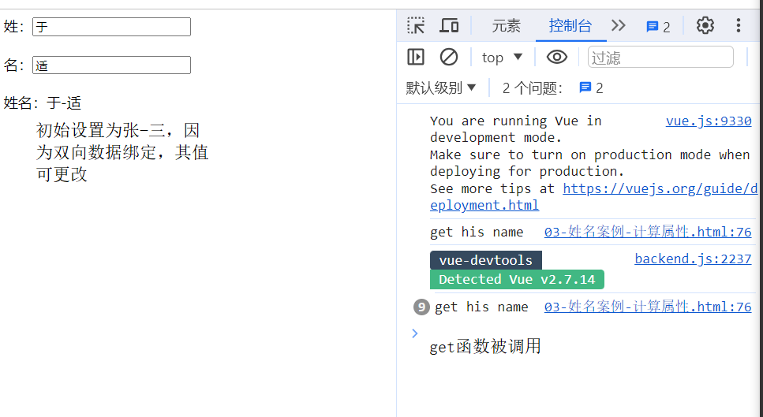

## VUE
* **VUE**
    * 什么是VUE？
        * 是一套用于构建用户界面的渐进式JavaScript框架，简单来说就是程序员把数据通过一系列操作(VUE)，变成用户看见的界面。前端开发工程师的职责：在合适的时候，发出合适的请求，把数据展示到合适的位置。
            * 渐进式：VUE可以自底向上逐层地应用，简单应用，只需引入一个100kb的轻量小巧的核心库；复杂应用的话可以引入各式各样的VUE插件。也就是逐渐从轻量小巧的核心库递进到使用各式各样的Vue插件库。
    * 谁开发的？
        * 尤雨溪 2013 Vue V0.60-2022 VUE V3.x
    * VUE的特点
        * 1. 采用组件化模式，提高代码复用率，且让代码更好维护。一个vue一个组件，可以把自己喜欢的vue文件引入过来，并直接使用，若想要修改某个部分的布局，就直接修改该vue文件的HTML结构即可，不会影响相邻的模块。
            * 
        * 2. 声明式编码，让编码人员无需直接操作DOM，提高开发效率。JS的命令式编码->VUE的声明式编码
        * 3. 使用虚拟DOM + 优秀的Diffing算法，尽量复用DOM节点。将原始的虚拟DOM与新的虚拟DOM进行比较(这个比较就叫Diff)，用Diffing算法进行比较后，一样的直接复用，不一样的增删改。
        * 4. 学习VUE之前要掌握的JS基础知识
            * ES6语法规范：解构赋值，模板字符串，箭头函数等
            * ES6模块化：默认/分别/统一暴露，import，export等
            * 包管理器：npm，yarn，cnpm等
            * 原型、原型链
            * 数组常用方法：过滤/加工数组，筛选最值等
            * axios：async await
            * promise...
    
* **第一章 Vue核心**
    * 1.1 Vue简介
        * 1.1.1 官网
            * 1. 英文官网: https://vuejs.org/
            * 2. 中文官网: https://cn.vuejs.org/
        * 1.1.2 介绍与描述
            * 1. 动态构建用户界面的渐进式 JavaScript 框架
            * 2. 作者：尤玉溪
        * 1.1.3 Vue的特点：
            * 1. 遵循MVVM模式
            * 2. 编码简介，体积小，运行效率高，适合移动端/PC端
            * 3. 它本身只关注 UI, 也可以引入其它第三方库开发项目
        * 1.1.4 与其他JS框架的关联
            * 1. 借鉴Angular的模板和数据绑定技术
            * 2. 借鉴React的组件化和虚拟DOM技术
        * 1.1.5 Vue周边库
            * 1. vue-cli：vue脚手架
            * 2. vue-resource
            * 3. axios
            * 4. vue-router：路由
            * 5. vuex：状态管理
            * 6. elemnt-ui：给予vue的UI组件库(PC端)
    * 1.2 初识Vue
        * ```
            <!-- 准备一个容器 -->
            <div id="root">
                <h1>hello，尚硅谷！</h1>
            </div>
          ```
        * 
        * 创建Vue实例，Vue实例化传且只传一个参数，并且类型是一个对象，管这种对象叫配置对象。像axios，传递的参数也是配置对象，配置对象的key值和value值都有要求，要用指定的，不能乱写，Vue的配置对象也一样。配置对象内的数据，只供与实例绑定的容器使用，以外的管不着。
            * 1. 想让Vue工作，就必须创建一个Vue实例，且要传入一个配置对象
            * 2. root容器里的代码依然符合html规范，只不过混入了一些特殊的Vue语法
                * ```<div id="root"><h1>Hello,{{name}}</h1></div>```中，{{name}}就是特殊语法
            * 3. root容器的代码被称为【Vue模板】
            * ```
                <!-- 创建Vue实例 -->
                const v=new Vue({
                    // 与容器建立关系，el用于制订单那个钱Vue实例为哪个容器服务，值通常为css选择器字符串, 
                    // el:'#root'，也可以写成el:document.getElementById('root')
                    el:'#root',
                    data:{ //data中用于存储数据，数据供el指定的容器使用，值先写成一个对象
                        name:'尚硅谷',
                    }
                })
              ```
            * 4. 一个Vue实例不能同时接管两个容器，Vue实例和容器是一一对应的关系。
                * ```
                    <!-- 准备一个容器 -->
                    <div id="root">
                        <h1>Hello,{{name}},{{address}}</h1>
                    </div>
                    <div id="root2">
                        <h1>Hello,{{name}},{{address}}</h1>
                    </div>
                    <script type="text/javascript">
                        Vue.config.productionTip=false  //组织vue在启动时生成生产提示。

                        // 创建Vue实例
                        new Vue({
                            // 与容器建立关系,el用于制订单那个钱Vue实例为哪个容器服务,值通常为css选择器字符串, 
                            // el:'#root',也可以写成el:document.getElementById('root')
                            el:'#root',
                            data:{ //data中用于存储数据，数据供el指定的容器使用，值先写成一个对象
                                name:'尚硅谷',
                                address:'深圳'
                            }
                        })
                        new Vue({
                            el:'#root2',
                            data:{
                                name:'atguigu',
                                address:'北京昌平'
                            }
                        })
                  ```
                * 
            * 5. 真实开发中只有一个Vue实例，并且会配合着组件一起使用。
            * 6. 写在容器里的{{xxx}}里的代码必须写JS表达式，且xxx可以自动读取到data中的所有属性。
            * 7. 一旦data中的数据发生改变，页面中用到该数据的地方也会自动更新
                    * 
    * 1.3 模板语法
        * 1.3.1 效果
            * 
        * 1.3.2 模板的理解，html中包含一些JS语法代码，语法分为两种，分别为：
            * 1. 插值语法(双大括号表达式)
            * 2. 指令语法(以 v- 开头)，用于管理标签属性
        * 1.3.3 插值语法
            * 1. 功能：用于解析/指定标签体内容
            * 2. 语法：{{xxx}}，xxx会作为js表达式解析，且可以直接读取到data中的所有属性
        * 1.3.4 指令语法
            * 1. 功能：用于解析/管理标签(包括标签属性、标签体内容、绑定事件...)
            * 2. 举例：v-bind:href="xxx" 或 简写为 :href="xxx"，xxx同样要写js表达式，且可以直接读取到data中的所有属性。
            * 3. 备注：Vue中有很多指令，且形式都是：v-???，在这里先学v-bind
    * 1.4 数据绑定
        * 1.4.1 效果
        * 1.4.2 单向数据绑定
            * 1. 语法：v-bind:href="xxx" 或简写为 :href
            * 2. 特点：数据只能从data流向页面
                * 
        * 1.4.3 双向数据绑定
            * 1. 语法：v-model:value="xxx" 或简写为 v-model="xxx"
            * 2. 特点：数据不仅能从data流向页面，还能从页面流向data
                * 
            * 3. 备注：
                * 双向绑定一般都应用在都应用在表单类元素上(如，input、select等)。
                * v-model:value 可以简写为 v-medel，因为v-medel默认收集的就是value值。
                * 如下类代码是错误的，因为v-model只能应用在表单类/输入类元素上，因为标题类标签无法捕获用户的输入，有value标签属性的就叫输入类元素。
                * ```<h2 v-model:x="name">hi</h2>```
    * 1.5 el和data的两种写法
        * 1.5.1 el的两种写法
            * 1. new Vue的时候配置el属性
            * 2. 先创建Vue实例，随后再通过vm.$mount('#root)指定el的值。
        * 1.5.2 data的两种写法
            * 1. 对象式
            * 2. 函数式
            * 选哪个？ 目前是哪个都行，以后学到组件的时候，必须写函数式，要不然出事儿
        * **1.5.3 一个重要原则**
            * 由Vue管理的函数，一定不能写箭头函数，必须是普通函数，一旦写了箭头函数，this指向的就不是Vue实例了，而是Window，且data函数也可以简写成```data(){....}```
                * ```
                    data:function(){
                        console.log('data',this);  //此处的this是Vue实例对象
                        return{
                            name:'谷江山'
                        }
                    }
                  ```
    * 1.6 MVVM模型
        * 1. M：模型(Model)：对应data中的数据
        * 2. V:视图(View)：模板
        * 3. VM：视图模型(ViewModel)：Vue实例对象
            * 
            * 
        * 观察发现：
            * 1. data中所有的属性，最后都出现在了vm身上
            * 2. vm身上是所有的属性 及 Vue原型上所有属性，在Vue模板中都可以直接使用
    * 1.7 数据代理
        * 1.7.1 Vue中的数据代理：
            * 通过vm对象来代理data对象中熟悉宁德操作(读/写)
        * 1.7.2 Vue中数据代理的好处：
            * 更加方便地操作data中的数据
        * 1.7.3 基本原理
            * 通过Object.defineProperty方法把data对象中所有的属性添加到vm上。
            * 为每一个添加到vm上的属性，都制定一个getter/setter。
            * 在getter/setter内部去操作(读/写)，data中对应的属性。
            * 
    * 1.8 事件处理
        * 1.8.1 效果
        * 1.8.2 绑定监听/事件的基本使用
            * 1. 使用v-on:xxx 或 @xxx 绑定事件，其中xxx是事件名；
            * 2. 事件的回调需要配置在methods对象中，最终会在vm上；
            * 3. methods中配置的函数，不可以使用箭头函数，否则this的指向就不是vm，而是Window；
            * 4. methods中配置的函数，都是被Vue所管理的函数，this的指向是vm或组件实例对象
            * 5. @click="demo" 或 @click="demo($event)" 效果一直，但后者可以传参。
                * ```
                    const vm=new Vue({
                        el:'#root',
                        data:{
                            name:'尚硅谷',
                            address:'北京'
                        },
                        methods:{
                            // 函数不能是箭头函数，只能是普通函数，否则this指向不同(箭头函数this为Window，普通函数才是vm，也就是Vue实例)，会导致后续出现一系列问题
                            showInfo1(event) {
                                // console.log(event.target.innerText);
                                // console.log(this===vm);  //此处的this是vm，也就是Vue实例对象
                                alert('你好')
                            },
                            showInfo2(event,number) {
                                // console.log(event.target.innerText);
                                // console.log(this===vm);  //此处的this是vm，也就是Vue实例对象
                                console.log(event,number);  //PointerEvent,66
                                // alert('hello')
                            }
                        }
                    })
                  ```
        * 1.8.3 事件修饰符
            * 1. prevent：阻止默认事件(常用)，一般点击弹出的提示框后会跳转到指定的网页中，给点击事件加上.prevent就不会跳转。
                * ```<a href="https://github.com/tianyuan65" @click.prevent="showInfo">click to baidu</a>```
            * 2. stop：阻止事件冒泡(常用)，冒泡事件会从子级冒到父级，添加.stop后不光不会从子级冒到父级，也不会从父级继承到子级。
                * ```
                    <div class="demo1" @click="showInfo">
                        <button @click.stop="showInfo">click to show information</button>
                    </div>
                  ```
            * 3. once：事件只触发一次(常用)，原本点击几次按钮就会弹出几次提示框，添加.once后，只会触发一次，第二次开始就不会触发。
                * ```<button @click.once="showInfo">click to show information</button>```
            * 4. capture：使用事件的捕获模式，添加该修饰符前，会先捕获子级，再捕获父级元素，添加.capture后会先捕获父级元素，再捕获子级。
                * ```
                    <div class="box1" @click.capture="showMsg(1)">
                        div1
                        <div class="box2" @click="showMsg(2)">div2</div>
                    </div>
                  ```
            * 5. self：只有event.target是当前操作的元素时才触发事件，点击的元素是什么，就输出什么，点了子级元素，绝不会展示父级元素。
                * ```
                    <div class="demo1" @click.self="showInfo">
                        <button @click="showInfo">click to show information</button>
                    </div>
                  ```
                * 
            * 6. passive：事件的默认行为立即执行，无需等待事件回调执行完毕，给鼠标滚轮事件添加该修饰符，首先执行滚轮事件，而不是触发滚轮事件的函数。
                * ```
                    <ul @wheel.passive="demo" class="list">
                        <li>1</li>
                        <li>2</li>
                        <li>3</li>
                        <li>4</li>
                    </ul>

                    demo(){
                        for (let i = 0; i < 100; i++) {
                            console.log('@@');
                        }
                        console.log('scrolled to die');
                    }
                  ```
            * 补充：
                *  修饰符可以连续写，以下面的代码为例，可以先阻止冒泡，再阻止默认跳转，也可以先阻止默认跳转，再阻止冒泡。虽然写法有出入，但效果是一样的。
                    * ```
                        <!-- 既阻止冒泡，又阻止默认事件 -->
                        <div class="demo1" @click="showInfo">
                            <!-- 先阻止冒泡，再阻止默认跳转，也可以是.prevent.stop，那就是先阻止默认事件，后阻止冒泡 -->
                            <a href="https://github.com/tianyuan65" @click.prevent.stop="showInfo">click to show information</a>
                        </div>
                      ```
        * 1.8.4 按键修饰符
            * 1. Vue中常用的按键别名：意思是，添加了这些按键别名的话，输入内容后，按了添加的按键别名才可以看到输出，如：``` <input type="text" placeholder="按下回车提示输入" @keyup.enter="showInfo">```
                * 回车 => enter
                * 删除 => delete(捕获“删除”和“退格”键)
                * 退出 => esc
                * 空格 => space
                * 换行 => tab，该按键别名只能搭配@keydown使用，因为它本身的特殊性，会把焦点从当前元素上切走，按下tab键，还没抬起来焦点就被切走了，这就导致无法正常触发事件。
                * 上 => up
                * 下 => down
                * 左 => left
                * 右 => right
            * 2. Vue未提供别名的按键，可以使用按键原始的key值去绑定，但注意要转为kebab-case(短横线命名)
            * 3. 系统修饰键(用法特殊)：ctrl、alt、shift、meta
                * 配合keyup使用：按下修饰键的同时，再按下其他键，随后释放其他键，事件才被触发
                    * 
                * 配合keydown使用：正常触发事件，与tab一样只能是配合keydown使用。
            * 4. 也可以使用keyCode去指定具体的按键(不推荐)，```@keydown.13```，以回车键为例，但不被推荐了
            * 5. Vue.config.keyCodes.自定义键名 = 键码，可以去定制按键别名
                * ```
                    <input type="text" placeholder="按下回车提示输入" @keydown.huiche="showInfo">
                    // 自定义按键别名
                    Vue.config.keyCodes.huiche=13
                  ```
            * 补充：
                * 按键修饰符也可以按照指定要求连写，以下方代码为例。
                    * ```
                        <!-- 按键修饰符也可以按照要求连写 -->
                        <input type="text" placeholder="按下回车提示输入" @keydown.ctrl.y="showInfo">
                      ```
                    * 
    * 1.9 计算属性与监视
        * 1.9.1 计算属性-姓名案例的三种实现
            * 1. 插值语法实现
                * ```
                    <!-- 容器 -->
                    <div id="root">
                        姓：<input type="text" v-model="firstName">
                        <br/>
                        <br/>
                        名：<input type="text" v-model="lastName">
                        <br/>
                        <br/>
                        姓名：<span>{{firstName}}-{{lastName}}</span>
                    </div>
                    <script type="text/javascript">
                        Vue.config.productionTip = false //阻止 vue 在启动时生成生产提示。

                        const vm=new Vue({
                            el:'#root',
                            data:{
                                firstName:'张',
                                lastName:'三'
                            }
                        })
                    </script>
                  ```
            * 2. methods实现，在展示姓名的标签span中，用插值将methods中的方法添加进去。若添加的是showName，那打印展示出来的就是showName这个函数；但若天家的事showName()，打印展示的才是调用showName方法后，其中返回的值，其返回值就用this.firstName/lastName来获取Vue实例中保存的姓和名。
                * ```
                    <!-- 容器 -->
                    <div id="root">
                        姓：<input type="text" v-model="firstName">
                        <br/>
                        <br/>
                        名：<input type="text" v-model="lastName">
                        <br/>
                        <br/>
                        <!-- 在插值语法里，把showName方法调用后的返回值插入到这个位置；但是只写showName的话，只是把showName这个函数插入到了这个位置 -->
                        姓名：<span>{{showName()}}</span>
                    </div>
                    <script type="text/javascript">
                        Vue.config.productionTip = false //阻止 vue 在启动时生成生产提示。

                        const vm=new Vue({
                            el:'#root',
                            data:{
                                firstName:'张',
                                lastName:'三'
                            },
                            methods:{
                                // 该方法不作为事件的回调使用，要我本人自己去调用
                                showName(){
                                    // 并返回其值
                                    return this.firstName + '-' + this.lastName
                                }
                            }
                        })
                    </script>
                  ```
            * 3. 计算属性实现
                * 定义：要用的属性不存在，要通过**已有属性**计算得来。
                * 原理：底层实现了Object.defineProperty方法提供的getter和setter。
                * get函数什么时候执行？
                    * (1). 初次读取时，会执行一次；
                    * (2). 当依赖的数据发生改变时，会被在此调用。
                * 优势：与methods实现相比，内部有缓存机制(复用)，效率更高，调试方便。
                * 备注：
                    * 1. 计算属性最终会出现在vm上，直接读取使用即可。
                    * 2. 如果计算属性要被修改，那必须写set函数去响应修改，且set中要引起计算时依赖的数据发生改变。
                * 完整代码如下：
                * ```
                    <!-- 容器 -->
                    <div id="root">
                        姓：<input type="text" v-model="firstName">
                        <br/>
                        <br/>
                        名：<input type="text" v-model="lastName">
                        <br/>
                        <br/>
                        <!-- 在插值语法里，把showName方法调用后的返回值插入到这个位置；但是只写showName的话，只是把showName这个函数插入到了这个位置 -->
                        姓名：<span>{{fullName}}</span>
                    </div>
                    <script type="text/javascript">
                        Vue.config.productionTip = false //阻止 vue 在启动时生成生产提示。

                        const vm=new Vue({
                            el:'#root',
                            // 在data中存着的是属性
                            data:{
                                firstName:'张',
                                lastName:'三'
                            },
                            // 计算属性放在这里，
                            computed:{
                                // 且计算属性里的对象属性也就是fullName不能直接赋值，要把整个计算过程配置成一个对象
                                fullName:{
                                    get(){
                                        console.log('get his name');
                                        // console.log(this);  //此处的this是Vue实例，也就是vm
                                        return this.firstName + '-' + this.lastName
                                    },
                                    set(value){
                                        // console.log('set the data',value);  //set the data 王五
                                        const arr=value.split('-')
                                        this.firstName=arr[0]
                                        this.lastName=arr[1]
                                    }
                                }
                            }
                        })
                    </script>
                  ```
                * 效果图们：
                    * 
                    * 
                    * 
                    * 
                    * 
                    * 
                    * 
            * 补充，计算属性简写版
                * 有个前提条件，一旦确定计算属性只考虑读取(读取Vue实例中的属性)，不考虑修改(不在控制台等地方中修改Vue实例的属性)时，也就是只读不改时，才可以使用简写形式。且此时fullName就当做函数用，这个函数就对应上面代码的get函数，fullName代表计算属性的名字，也代表函数的名。代码如第一个，再进一步简写可得第二个代码段，表面上fullName是一个函数，但实际上，是fullName函数执行完后，向Vue实例放了一个叫fullName的属性，此时Vue实例中fullName属性的值就是fullName函数调用的结果。效果和完整版是一样的，图片就不展示了。
                    * ```
                        fullName:function () {
                            console.log('get his name');
                            // console.log(this);  //此处的this是Vue实例，也就是vm
                            return this.firstName + '-' + this.lastName
                        }
                      ```
                    * ```
                        fullName () {
                            console.log('get his name');
                            // console.log(this);  //此处的this是Vue实例，也就是vm
                            return this.firstName + '-' + this.lastName
                        }
                      ```
        * 1.9.2 监视属性(watch)-天气案例
            * 1. 用计算属性完成，配置computed属性，在computed中设置info函数，info函数中进行this.isHot值的判断，并返回其值，作为info属性的值，放在切换天气的模板中。methods中配置changeWeather函数，并绑定在切换天气状态的按钮上，changeWeather函数内将与this.isHot相反的值赋给它，以便在点击按钮时，切换天气状态。
                * ```
                    <div id="root">
                        <h1>今天天气很{{info}}</h1>
                        <button @click="changeWeather">切换天气</button>
                    </div>
                    <script type="text/javascript">
                        Vue.config.productionTip = false //阻止 vue 在启动时生成生产提示。

                        const vm=new Vue({
                            el:'#root',
                            data:{
                                isHot:true
                            },
                            computed:{
                                info(){
                                    console.log(this.isHot);  //炎热时true，凉爽时false
                                    return this.isHot?'炎热':'凉爽'
                                }
                            },
                            methods:{
                                changeWeather(){
                                    this.isHot=!this.isHot
                                }
                            }
                        })
                    </script>
                  ```
                * 切换效果图
                    * 
                    * 
                    * 
                    * 
            * 2. 监视属性watch
                * (1). 当贝监视的属性变化时，回调函数自动调用你，进行相关操作
                * (2). 监视的属性必须存在，才能进行监视！！
                * (3). 监视属性完成天气案例方法1，Vue实例中配置watch属性。在watch中添加想要监视的属性名，并为其配置对象，在其中设置handler函数，handler函数在监视的属性的值(在这里是isHot)发生改变时，会被调用。所以，总结的话，想要监视哪个属性，watch属性中，就写那个想要监视的属性名，并为其配置对象，比如computed属性中的info也可以被监视，代码和效果图就不写了。
                * 
                * handler函数：handler函数还会接收两个参数，newValue和oldValue，该函数可以获取和输出新值和旧值，效果如下图：
                    * 
                * immediate：初始化时，让handler调用一下，其默认值为false，但将其值改为true时，handler就会先于其他函数执行，如图：
                    * 
                * ```
                    watch:{
                        // 想要监视谁，就写谁的名字，在这里是isHot；怎么监视，需要配置一个对象
                        isHot:{
                            // immediate属性，表示是否立即执行，默认值为false，handler函数不会立即执行，当将其值改为true时，handler函数就会被立即调用
                            immediate:true,
                            // handler函数什么时候调用？当isHot发生改变时
                            handler(newValue,oldValue){
                                console.log('handler function run,isHot is modified','new:',newValue,'old:',oldValue);
                            }
                        }
                    }
                  ```
                * 监视属性完成天气案例方法2。首先保证，Vue实例已创建，创建实例后，用$watch()，来实现监视。$watch()中传递两个参数，第一个参数是要监视的属性/对象名，第二个参数就是为其配置的对象.
                    * ```
                        vm.$watch('isHot',{
                            // immediate属性，表示是否立即执行，默认值为false，handler函数不会立即执行，当将其值改为true时，handler函数就会被立即调用
                            // immediate:true,
                            // handler函数什么候调用？当isHot发生改变时
                            handler(newValue,oldValue){
                                console.log('handler function run,isHot is modified','new:',newValue,'old:',oldValue);
                            }
                        })
                    ```
            * 补充：两种方式选择哪种？若很明确监视的属性/对象，在创建Vue时，已明确要监视的属性/对象，就用第一个，也就是把要监视的属性/对象名写在watch属性里；但若创建实例时，要监视的属性/对象不明确，后续需要根据用户的行为明确了需要监视的属性/对象时，就用第二个方法，也就是在外面使用$watch()，在其中$watch()内传递两个参数，第一个参数为要监视的属性/对象名，第二个参数就是为其配置的对象，对象内内容和第一个方法watch对象的内容一样，效果也一样。
            * 3. 深度监视
                * 3.1 Vue中的watch默认不检测对象内部值的改变(一层)
                    * 监视多级结构中某个属性的变化时，需要监视的属性名，也就是key要求写最原始的写法，像```'numbers.a'```
                        * ```
                            data:{
                                isHot:true,
                                numbers:{
                                    a:1,
                                    b:1
                                }
                            },
                            watch:{
                                // 监视多级结构中某个属性的变化，key最原始的写法，这样就可以检测到a了
                                'numbers.a':{
                                    handler(){
                                        console.log('a is changed');
                                    }
                                }
                            }
                          ```
                        * 
                * 3.2 配置deep:true可以监测对象内部值改变(多层)
                    * 监视多级结构中的多个/所有属性的变化时，给需要监视的属性内配置deep配置项，deep属性默认值为false，开启该配置属性后，监视的属性内的任何一个子属性发生变化，都会调用handler函数。
                        * ```
                            data:{
                                isHot:true,
                                numbers:{
                                    a:1,
                                    b:1
                                }
                            },
                            watch:{
                                numbers:{
                                    // 添加deep配置项，其默认值为false，一旦开启，numbers属性内的任何一个属性的值发生变化都会调用handler函数
                                    deep:true,
                                    handler(){
                                        console.log('numbers changed');
                                    }
                                }
                            }
                          ```
                        * 
                    * (1). Vue自身可以监测对象内部值的改变，但Vue提供的watch默认不可以！！
                    * (2). 使用watch时，根据数据的具体结构，决定是否采用深度监测。


* **第二章 Vue组件化编程**
* **第三章 使用Vue脚手架**
* **第四章 Vue中的ajax**
* **第五章 vuex**
* **第六章 vue-router**
* **第七章 Vue UI组件库**

* 补充
    * 不改变就不用重新调用，在中间做了一个缓存，相当于这个值vue帮你存了，你用我就给你，随时用随时给，但是就不用再重复计算了
    * 被Vue管理的函数绝对不可以写箭头函数，只能是一般函数，写成箭头函数的后果就是，函数内this的指向不再是Vue实例，而是Window。但向后端发送axios请求时，必须要用箭头函数，普通函数不行。
    * 在容器里/模板里写代码的时候，想好要读取的是什么，是data中配置的数据，还是methods中的配置的方法，还是computed中配置的计算属性。
    * 对象里的key从来不自己包引号
    * Vue默认是无法监视多级结构里的属性变化